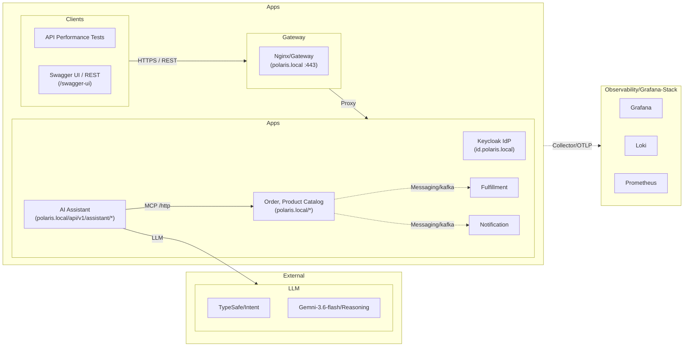

# Polaris - Enterprise Assistant Backend

Polaris is an enterprise backend service powering intelligent e-commerce operations, product discovery, conversational shopping, and order lifecycle management. Designed for direct integration with AI assistants and modern web clients, Polaris is organized as a modular polyglot monorepo exposing standards-compliant REST APIs secured by OAuth2/OIDC alongside a native Model Context Protocol (MCP) server.

---

## Business Domains & Capabilities

Polaris is organized around clear bounded contexts adhering to Domain-Driven Design (DDD) principles:

### 1. Product Catalog and Order management 
- (`/api/v1/products`): manage product & inventory
- (`/api/v1/categories`): manage product category
- (`/api/v1/orders`): manage orders

### 2. AI Assistant Context (`/api/v1/assistant/chat`)
* **Autonomous Microservice**: Standalone service (`apps/polaris-assistant`) decoupled from core commerce databases, routed via gateway sub-path `/api/v1/assistant/*` under `https://polaris.local`.
* **Turn-Level Distributed Observability**: Enclosing distributed tracing span (`agent.turn`) with structured lifecycle milestone events (`agent.request.received`, `tools.discovered`, `agent.iteration.started`, `model.request`, `model.response`, `agent.tool.call`, `agent.tool.result`, `agent.response.generated`, `agent.completed`) capturing autonomous ReAct loop progression in Grafana Tempo.
* **Intent Resolution & Policy Governance**: Intent-based tool filtering, defensive tool validation, and OAuth2/OIDC scope authorization directly integrated into the conversational workflow without bespoke abstraction overhead.
* **GenAI Observability & Tool Audit Standards**: Conforms to OpenTelemetry GenAI Semantic Conventions (v1.27+) (`gen_ai.operation.name="chat"`, token usage breakdowns, finish reasons, iteration/intent context attribution) alongside defensive MCP tool audit tags (`gen_ai.tool.name`, policy scopes, validation status, result byte size) and sampled thought signature log streams ([PRD-006](docs/business/prds/PRD-006-genai-observability-and-tool-audit.md), [ADR-0016](docs/technical/decisions/0016-genai-observability-and-mcp-audit-standards.md)).

### 3. Integration
* **MCP Integration**: Consumes product catalog and order operations from Polaris Core exclusively via Model Context Protocol (`/mcp`).


* **Enterprise Security**: OAuth2/OIDC Bearer token authentication strictly enforced across all MCP endpoints (zero security bypass).

### 4. Identity & Access Context (`https://id.polaris.local`)
* **Standards-Based Authentication**: OAuth 2.0 and OpenID Connect (OIDC) via Keycloak (`polaris` realm).
* **Cryptographic Token Verification**: Stateless JWT validation with PKCE support for client browsers, Swagger UI, and autonomous assistants.

---

## Development Architecture



---

## Up the Stack in a Minute

Get the entire environment—including local HTTPS, identity provider, core backend, PostgreSQL databases, and telemetry—running locally in under 60 seconds:

### 1. Prerequisites
- Docker & Docker Compose
- macOS or Linux
- [`mkcert`](https://github.com/FiloSottile/mkcert) (for trusted local TLS certificates)

### 2. Quick Start
```bash
# 1. Initialize environment file (DEFAULT_PASSWORD is the password of the seeded users and the Grafana admin)
cp .env.template .env

# 2. Configure local TLS certificates and hostnames (one-time setup)
./scripts/setup-local-https-mac-m1.sh

# 3. Boot the complete local stack
make up
```

### 3. Access & Verify Endpoints

| Portal | URL | Credentials / Action |
|---|---|---|
| **Polaris Swagger UI** | [https://polaris.local/swagger-ui/index.html](https://polaris.local/swagger-ui/index.html) | Unified Swagger UI for Core & Assistant (select definition in top dropdown) &rarr; Authorize with `testuser` / `testpass` |
| **Assistant Chat API** | `POST https://polaris.local/api/v1/assistant/chat` | AI Assistant chat conversation endpoint (Requires OAuth2 Bearer token) |
| **Polaris MCP Endpoint** | `POST https://polaris.local/mcp`<br/>[https://polaris.local/mcp/sse](https://polaris.local/mcp/sse) | MCP JSON-RPC stateless HTTP & SSE endpoints (Requires OAuth2 Bearer token) |
| **Keycloak Admin** | [https://id.polaris.local](https://id.polaris.local) | Username: `admin` \| Password: `admin` |
| **Grafana Telemetry** | [https://grafana.polaris.local](https://grafana.polaris.local) | Keycloak SSO via the **master** realm (provisioned `grafana-admin`, password `DEFAULT_PASSWORD` in `.env`; or any master user with `grafana` client role `viewer`, `editor` or `admin`; polaris realm users such as `testuser` have no Grafana access) or the local `GRAFANA_ADMIN_USER` (default `admin`) / `DEFAULT_PASSWORD` from `.env`. Grafana is the only telemetry UI behind the gateway; Prometheus, Loki, Tempo and the Collector publish no host port. For host-side tooling (`make run` apps, Prometheus/Loki/Tempo APIs) use `make up-dev-ports` (loopback only) |
| **Polaris Database** | Internal `polaris-db:5432` | `make polaris-sql` opens psql into PostgreSQL 16 database |
| **Kafka** | Internal `kafka-{1,2,3}:9092` · host `localhost:9094-9096` | Three-node KRaft cluster (every node broker + controller), no auto-created topics: each owner provisions its own (Order: `polaris.order.lifecycle`, 3 partitions × 3 replicas, min ISR 2, [ADR-0019](docs/technical/decisions/0019-kafka-and-cloudevents-binding.md)). `make run` bootstraps from `localhost:9094-9096`. See [Kafka cluster experiments](#kafka-cluster-experiments) |

> **Shopper accounts & realm changes:** `alice.tran`, `ben.nguyen` and `chi.le` (password `testpass`, realm role `shopper`) are linked to the seeded customers by `customers.auth_subject` (Flyway V12). Keycloak imports `docker/keycloak/polaris-realm.json` only when its volume is empty, so after pulling realm changes run `make clean && make up` to re-import them.

---

## Essential Developer Commands

| Target | Command | Purpose |
|---|---|---|
| **Start Stack** | `make up` | Starts all services in the background (Apps + DBs + LGTM stack) |
| **Check Stack Status**| `make status` | Inspects container health, ports, and lifecycle states |
| **Stop Stack** | `make down` | Stops containers and networks (preserves persistent dev volumes) |
| **Clean Stack** | `make clean` | Stops containers, removes orphan containers and volumes |
| **Rebuild Images** | `make build` | Rebuilds the Polaris Spring Boot application container images |
| **Restart Service** | `make restart-<service>` | Restarts a single container (e.g. `make restart-polaris`) |
| **Run All Tests** | `make test` / `mvn clean test` | Executes local Java unit & domain integration tests across all modules |
| **Performance Tests** | `make test-perf` | Executes k6 API performance and contract validation suite in Docker |
| **Concurrency Tests** | `make test-concurrency` | Executes k6 high-concurrency inventory race condition audit in Docker |
| **Telemetry CLI** | `make gcx` / `./gcx.sh` | Queries Tempo traces and Loki logs in-terminal via Grafana gcx CLI |
| **Test Single Module** | `mvn test -pl apps/polaris` | Executes tests for a single module (e.g. `apps/polaris`) |
| **Playwright UI Testing** | `make playwright-ui` | Opens Swagger UI in Playwright for browser automation |
| **Close Playwright** | `make playwright-close` | Closes all open Playwright browser sessions |
| **Access Polaris DB** | `make polaris-sql` | Opens psql shell into the containerized PostgreSQL DB |
| **Kafka Topics** | `make kafka-topics` | Describes every non-internal topic (partitions, replicas) on the local broker |
| **Tail Kafka Topic** | `make kafka-tail TOPIC=<topic>` | Prints a topic from the beginning with key, headers, partition and offset |
| **Kafka Cluster** | `make kafka-cluster` | Controller quorum (leader, voters, lag) and any under-replicated partitions |
| **Kafka Offsets** | `make kafka-offsets [TOPIC=<topic>]` | End offset per partition: how keys spread over partitions |
| **Kafka Groups** | `make kafka-groups` | Every consumer group: partition assignment and lag |
| **Kafka Leaders** | `make kafka-leaders` | Moves each partition's leadership back to its preferred replica |
| **Stop/Start a Broker** | `make kafka-stop-2` / `make kafka-start-2` | Takes one node down or brings it back (Kafka targets accept `NODE=2` when `kafka-1` is down) |

---

## Kafka Cluster Experiments

The dev stack runs three Kafka nodes (`kafka-1..3`). Each node is both a broker and a KRaft controller. `polaris.order.lifecycle` has 3 partitions, each with 3 replicas, and `min.insync.replicas=2`. The outbox sends with `acks=all`, so a write needs 2 replicas in sync.

| Experiment | Do | What you see |
|:--|:--|:--|
| **Partitioning** | Place a few orders, then `make kafka-offsets` and `make kafka-tail TOPIC=polaris.order.lifecycle` | Each order number (the record key) hashes to one partition (murmur2 % 3). All of an order's events land there in order. Different orders spread over the three partitions |
| **Replicas & leaders** | `make kafka-topics` | One leader per partition, spread over the nodes. `Replicas` lists the preferred order, and `Isr` shows which replicas are caught up |
| **Lose one node** | `make kafka-stop-1`, then `make kafka-topics NODE=2`, then place an order | Partitions that `kafka-1` led elect a new leader, and the ISR shrinks to 2. Writes still succeed (2 ≥ min ISR), and the controller quorum (2 of 3 voters) keeps working |
| **Lose two nodes** | Also run `make kafka-stop-2` and place an order | The API still returns `201`, but the event stays `PENDING`: `acks=all` gets `NotEnoughReplicasException` (1 < min ISR), and the controller quorum has lost its majority. Start the nodes again and the relay delivers the event (TR-B7) |
| **Recover** | `make kafka-start-1 kafka-start-2`, then `make kafka-cluster` | The restarted replicas catch up and rejoin the ISR. Leadership stays where it moved until the preferred-leader check runs (every 5 min) or you run `make kafka-leaders` |
| **Consumers** (Plans 3–4) | `make kafka-groups` | Each partition is assigned to one consumer in a group. Consumers beyond the partition count (3) sit idle |

Before this change the stack had a single `kafka` service. Remove its orphaned container and volume with `docker rm -f kafka && docker volume rm 03-polaris_kafka_data` (check the volume name with `docker volume ls`), or run `make clean`.

---

## Detailed Guides & Deep Dives

To keep daily development focused, detailed guides for specialized areas are maintained separately:

- 🔐 [**Local HTTPS Setup**](scripts/setup-local-https-mac-m1.sh): Manual setup script for `mkcert` and Java truststore.
- 📐 [**Architecture Decision Records (ADRs)**](docs/technical/decisions/): Formal architecture records (e.g., [ADR-0008: Polaris Assistant Isolation](docs/technical/decisions/0008-polaris-assistant-independent-application-mcp-architecture.md), [ADR-0009: Unified Gateway Sub-Path Routing](docs/technical/decisions/0009-gateway-subpath-routing-for-applications.md), [ADR-0010: MCP Client Authentication](docs/technical/decisions/0010-mcp-client-authentication-and-token-forwarding.md)).
- 🔍 [**ADR-0011: Gemini Distributed Tracing**](docs/technical/decisions/0011-gemini-model-call-distributed-tracing.md): Distributed tracing and W3C context propagation for AI model calls.
- 🌐 [**ADR-0012: MCP Cross-Service Distributed Tracing**](docs/technical/decisions/0012-mcp-cross-service-distributed-tracing.md): Cross-service trace propagation via W3C `traceparent` and server-side MCP tool execution spans.
- ⏱️ [**ADR-0013: AI Assistant Turn Observability & Lifecycle Events**](docs/technical/decisions/0013-agent-turn-span-and-lifecycle-events.md): Enclosing trace span (`agent.turn`) and structured span events for ReAct agent loop execution.
- 🎯 [**ADR-0014: Agent Decision Events and Observability Schema**](docs/technical/decisions/0014-agent-decision-events-and-observability-schema.md): *(Superseded)* Legacy decision event recording, superseded by standard OpenTelemetry GenAI semantics and native Micrometer tracing.
- 🛡️ [**ADR-0015: Intent Management and Policy Engine Architecture**](docs/technical/decisions/0015-intent-management-and-policy-engine-architecture.md): Proactive tool set narrowing, defensive tool validation, OAuth2 scope authorization, and intent observability.
- 🔍 [**ADR-0016: GenAI Observability and MCP Tool Audit Standards**](docs/technical/decisions/0016-genai-observability-and-mcp-audit-standards.md): Standards-based OTel GenAI conventions, MCP tool execution auditability, PII/PCI redaction, and sampled reasoning logs.
- 📈 [**ADR-0020: Grafana AI Observability Compatible GenAI Telemetry**](docs/technical/decisions/0020-grafana-ai-observability-genai-telemetry.md): agento11y SDK owns the `generateText`/`execute_tool` spans and `gen_ai.client.*` metrics; provisioned local AI Observability dashboard.
- 📋 [**Product Requirements (PRDs)**](docs/business/prds/): Product requirement documents for catalog, orders, and AI assistant.
- 📋 [**PRD-004: AI Model Observability**](docs/business/prds/PRD-004-gemini-model-observability-and-distributed-tracing.md): Business requirements and personas for GenAI distributed tracing.
- 📋 [**PRD-005: AI Assistant Turn Observability**](docs/business/prds/PRD-005-agent-turn-observability-and-lifecycle-events.md): Business requirements, personas, and acceptance criteria for agent turn lifecycle telemetry.
- 📋 [**PRD-006: GenAI Observability and Tool Audit**](docs/business/prds/PRD-006-genai-observability-and-tool-audit.md): Business requirements, acceptance criteria, and governance standards for AI model and tool execution observability.
- 🏛️ [**Architecture, Design & Code Principles**](AGENTS.md): Foundational requirements for lower-layer protocol alignment, bounded context containment, and cross-cutting observability.
- 🛠️ [**Engineer Guidelines**](Engineer-Guidelines.md): Operational conventions, inner-loop debugging, test hierarchy, and fleet roles.