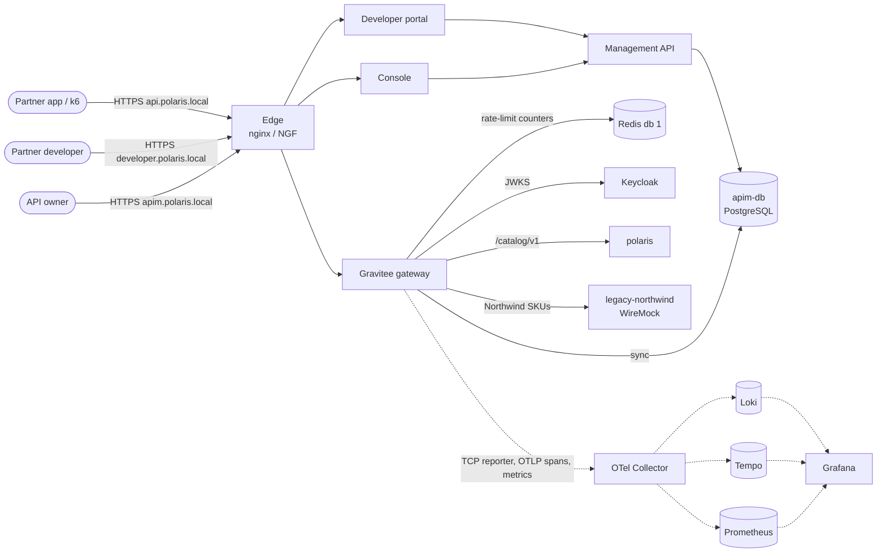

# API Management

- **Scope:** add Gravitee APIM Community Edition as a managed public API layer at `https://api.polaris.local`, and use it to practise the APIM role in an acquisition-heavy enterprise: consumer onboarding, plans and quotas, mediation over a legacy back end, migration behind a stable contract, versioning, resilience and consumer analytics
- **Target:** Compose first (optional `apim` profile), then the kind cluster from [Kubernetes Deployment](k8s-deployment.md)
- **Detail design:** [ADR-0022](../../technical/decisions/0022-api-management-platform.md)
- **Depends on:** — for A1–A8 (Compose) · K8 and K12 of [Kubernetes Deployment](k8s-deployment.md) for A9 · **Unblocks:** an optional Azure APIM comparison lab (ADR-0022 §6, out of scope)
- **Status:** Draft for review

## Goal

`docker compose --profile apim up` starts the Gravitee gateway, management API, console and developer portal next
to the existing stack. A partner developer opens `https://developer.polaris.local`, registers an application and
subscribes to a plan. They get a Keycloak client-credentials token and call `https://api.polaris.local/catalog/v1/...`.
Calls are authenticated, limited by plan and routed to `polaris` or to a simulated legacy back end from an
acquisition, and every call shows up in Grafana per API, plan and application, with one trace down to the back end.

The first-party routes on `https://polaris.local` (ADR-0009) don't change, and nothing in this plan changes
application code in `polaris`, `polaris-assistant` or `polaris-fulfilment-emulator`.

## Technical Requirements

| ID | Requirement |
|:--|:--|
| TR-A1 | **Optional and isolated:** the APIM runs under the Compose profile `apim` (and later an optional Kubernetes component). Without the profile, the stack behaves exactly as today. The public API is a separate host, `api.polaris.local` |
| TR-A2 | **Configuration as code:** APIs, plans, policies and pages live in `deploy/apim/` and are applied by `scripts/apim/apply.sh` through the Management API. Applying is idempotent. The console is for exploration, and git is the source of truth. Every image is pinned |
| TR-A3 | **One identity provider:** consumer applications are Keycloak confidential clients (client credentials grant). The gateway validates JWTs against Keycloak's JWKS at the public issuer `https://id.polaris.local/realms/polaris`. The APIM never issues tokens. Console and portal sign-in go through Keycloak OIDC |
| TR-A4 | **Contracts are OpenAPI:** each public API is defined by an OpenAPI 3.x document in `deploy/apim/openapi/`. A contract test checks every response through `api.polaris.local` against it |
| TR-A5 | **Standard errors and headers:** errors produced by the gateway (401, 403, 404, 410, 429, 502, 504) are `application/problem+json` (RFC 9457). 429 carries `Retry-After`. Rate-limit state is exposed with `RateLimit-Policy` / `RateLimit` headers. Deprecated versions carry `Deprecation` (RFC 9745) and `Sunset` (RFC 8594) |
| TR-A6 | **No business logic in the gateway:** policies authenticate, limit, route, transform shape and cache. They never call more than one back end per request or make domain decisions (AGENTS.md Principle 2.2) |
| TR-A7 | **Observable through the existing stack, no analytics store:** the Gravitee analytics repository is off. Per-request records go TCP reporter → OTel Collector → Loki, gateway metrics go to Prometheus, spans go over OTLP to Tempo (ADR-0022 §4.5). Loki labels stay low-cardinality (`service_name`, `api`, `plan`). `traceparent` is continuous edge → gateway → back end |
| TR-A8 | **Verified automatically:** each slice extends `tests/apim/smoke.sh` and, where load matters, k6 tests in `tests/apim/k6/`. They use the same public interfaces as a real consumer (HTTPS through the edge, Keycloak tokens). A `make apim-smoke` target runs them |

## Decisions

| # | Decision | Default chosen | Why | Alternative |
|:--|:--|:--|:--|:--|
| D1 | APIM product | **Gravitee APIM CE 4.x** (latest 4.x at A1 start, pinned) | Full APIM role in open source (ADR-0022 §3) | Kong OSS (frozen at 3.9), Azure APIM (paid, cloud only), APISIX (no portal) |
| D2 | Management storage | **JDBC on a dedicated PostgreSQL 16 container `apim-db`** (CNPG `Cluster` on Kubernetes) | One database per owner, as for `polaris-db` and `keycloak-db`. No MongoDB | MongoDB (Gravitee's default) |
| D3 | Rate-limit storage | **Existing Redis, logical database 1** | Distributed counters across gateway replicas without a new container | Dedicated Redis (revisit if eviction becomes a problem, see Risks) |
| D4 | Analytics | **None in Gravitee.** TCP reporter → Collector `tcplog` receiver → Loki | ADR-0022 §4.5 | OpenSearch analytics repository |
| D5 | Config as code format | **Gravitee Kubernetes Operator CRD documents** (`ApiV4Definition`, `Application`, `ManagementContext`) stored in `deploy/apim/`. On Compose, `apply.sh` sends them to the Management API's CRD import endpoint, the same endpoint the operator calls. On Kubernetes (A9), the operator applies the same files | One format for both environments, no drift between two definitions. To verify in A1: if the import endpoint can't be used outside the operator, fall back to v4 definition JSON for Compose and record the change | Separate JSON for Compose and CRDs for Kubernetes |
| D6 | Edge | **nginx (Compose) / NGINX Gateway Fabric (Kubernetes) keep terminating TLS** and route `api.`, `developer.` and `apim.polaris.local` to Gravitee | One edge, the same as for all other hosts. The existing `*.polaris.local` certificate already covers the new hosts | Expose Gravitee directly |
| D7 | Legacy back end | **WireMock** container `legacy-northwind`, with mappings in `deploy/apim/legacy-northwind/` | Simulates an acquired company's system through configuration alone. Fault injection (delays, resets) is built in for A8 | A new stub application |
| D8 | Public API path | **`/catalog/v1/**`** on `api.polaris.local`, mapped to `polaris` `/api/v1/products/**` and `/api/v1/categories/**` | The public contract is product-shaped and independent from internal paths, so internal paths can change behind it | Expose internal paths unchanged |

## Topology



## Repository layout

```
deploy/apim/
  gravitee.env              # non-secret gateway / management API settings (secrets come from .env)
  openapi/                  # public contracts: catalog-v1.yaml, catalog-v2.yaml
  apis/                     # ApiV4Definition documents (one per public API version)
  applications/             # Application documents for the seeded test partners
  legacy-northwind/         # WireMock mappings and fixtures
docker/telemetry/grafana/provisioning/dashboards/apim/   # APIM dashboards
scripts/apim/               # apply.sh, token.sh (client-credentials helper)
tests/apim/                 # smoke.sh, contract test, k6/
```

## Slices

### Slice Tracker

Slices run top to bottom; only the `execute-plan` coordinator edits this table.

| # | Slice | Title | Status | External | Branch | PR | Notes |
|:--|:--|:--|:--|:--|:--|:--|:--|
| 1 | A1 | Gateway on Compose and the first managed API | `in-progress` | ADR-0022 reviewed | | | |
| 2 | A2 | Developer portal, applications and subscriptions | `todo` | — | | | |
| 3 | A3 | Consumer analytics in Grafana | `todo` | — | | | |
| 4 | A4 | Plans, rate limits and quotas | `todo` | — | | | |
| 5 | A5 | Acquired back end: Northwind legacy catalog | `todo` | — | | | |
| 6 | A6 | Migration behind a stable contract | `todo` | — | | | |
| 7 | A7 | Versioning and sunset | `todo` | — | | | |
| 8 | A8 | Resilience towards back ends | `todo` | — | | | |
| 9 | A9 | APIM on Kubernetes | `todo` | K8 and K12 of the Kubernetes plan are `done` | | | |

**Statuses:** `todo` → `in-progress` → `in-review` → `approved` (not merged) → `done` (merged), plus `blocked` (reason in *Notes*) and `dropped`.

### A1: Gateway on Compose and the first managed API
**Covers:** TR-A1, TR-A2, TR-A3, TR-A4, TR-A5 (401/403/404), TR-A7 (traces only), D1, D2, D3, D5, D6, D8.
- Compose profile `apim`: Gravitee gateway, management API and console at pinned versions, plus `apim-db` (PostgreSQL 16). Management repository on JDBC, rate-limit repository on Redis database 1. **Analytics repository off**: confirm the chosen version starts and runs with it off. If it can't, stop and mark the slice `blocked` (ADR-0022 Risks).
- nginx: server blocks for `api.polaris.local` (to the gateway) and `apim.polaris.local` (to the console and management API). `api.polaris.local` and `apim.polaris.local` are added to `DOMAINS` in `scripts/setup-local-https-mac-m1.sh` and to the nginx network aliases.
- Keycloak `polaris` realm: a confidential client `partner-acme` (client credentials only) with the catalog read permissions that `polaris` checks. The secret comes from `.env` (`APIM_PARTNER_ACME_SECRET`, added to `.env.template`).
- `deploy/apim/openapi/catalog-v1.yaml` (list products, get product by SKU, list categories) and an `ApiV4Definition` for `/catalog/v1` with a JWT plan validated against Keycloak's JWKS. The consumer's token is forwarded to `polaris` unchanged, so `polaris` authorises with its own permission checks.
- `scripts/apim/apply.sh` applies `deploy/apim/` idempotently (D5: confirm the CRD import endpoint, or fall back and record it). `scripts/apim/token.sh` fetches a client-credentials token.
- Gateway tracing over OTLP to the Collector, joining the edge's `traceparent`.
- Gateway errors use problem+json (a response template per error key).
- Smoke: without a token → 401 problem+json. With a `partner-acme` token → 200, and the body matches `catalog-v1.yaml`. Unknown path → 404 problem+json. One trace contains the nginx, gateway and `polaris` spans. `docker compose up` without the profile is unchanged.

### A2: Developer portal, applications and subscriptions
**Covers:** TR-A2, TR-A3, TR-A5 (403).
- Developer portal at `developer.polaris.local` (nginx block, `DOMAINS` entry). Console and portal sign-in through Keycloak OIDC (new public clients with PKCE in the `polaris` realm). API owners get console roles from a Keycloak client role, the same pattern as Grafana.
- The JWT plan now requires a subscription. The gateway matches the token's `azp` / `client_id` to a Gravitee application's client ID.
- Seeded applications in `deploy/apim/applications/`: `partner-acme` (subscribed) and `partner-globex` (Keycloak client exists, no subscription).
- The catalog API is published in the portal with its OpenAPI documentation and a getting-started page from `deploy/apim/pages/`.
- A runbook section in `docs/operations/apim.md`: how a partner is onboarded (Keycloak client → Gravitee application → subscription), and how a subscription is revoked.
- Smoke: `partner-acme` token → 200. `partner-globex` token (valid JWT, no subscription) → 403 problem+json. After revoking `partner-acme`'s subscription through the Management API → 403, and after restoring it → 200.

### A3: Consumer analytics in Grafana
**Covers:** TR-A7, D4.
- Gateway TCP reporter (JSON) → Collector `tcplog` receiver with a JSON parser → Loki. Labels: `service_name="apim-gateway"`, `api`, `plan`. Application, subscription, status, latency and `trace_id` stay as fields.
- Collector scrapes the gateway's Prometheus endpoint.
- Grafana dashboard "API Management" provisioned from git: calls, error rate and p95 latency per API and plan, top applications by calls and errors (LogQL `| json` aggregations), and a link from a record's `trace_id` to Tempo.
- Grafana shows APIM data alongside the other dashboards. Grafana Cloud receives it too when its exporter is configured.
- Smoke: a call made by `partner-acme` produces one Loki record with `api`, `plan`, `application`, `status` and `trace_id`. The `trace_id` resolves in Tempo. The fields the dashboard uses are asserted, so a Gravitee upgrade that renames them fails the test.

### A4: Plans, rate limits and quotas
**Covers:** TR-A5 (429), D3.
- Three plans on the catalog API: Free (10 req/s, 1 000 per day), Partner (50 req/s, 100 000 per day), Premium (200 req/s, no daily quota). `partner-acme` on Partner, a new `partner-initech` on Free.
- Counters in Redis, so limits hold across two gateway replicas (the Compose profile runs two).
- 429 problem+json with `Retry-After`, and `RateLimit-Policy` / `RateLimit` headers on every response.
- k6 test `tests/apim/k6/plans.js`: Free is throttled at its limit across both replicas, and Partner isn't throttled at the same load. The A3 dashboard shows 429s per plan and application.
- Smoke: a short burst over the Free limit gets 429 with `Retry-After`.

### A5: Acquired back end: Northwind legacy catalog
**Covers:** TR-A4, TR-A6, D7.
- `legacy-northwind` WireMock container in the `apim` profile. It answers product lookups in Northwind's own XML format, with its own field names and `NWP-` product codes. Mappings and fixtures in `deploy/apim/legacy-northwind/`.
- The catalog API routes `GET /catalog/v1/products/{sku}` with SKU prefix `NW-` to Northwind. The gateway maps `NW-<n>` to `NWP-<n>`, converts XML to JSON and reshapes the payload to the `catalog-v1.yaml` product schema. Other SKUs go to `polaris` as before.
- Northwind is called with its own credential (a static key from `.env`, as legacy systems typically use). The consumer's JWT is not forwarded to it.
- Contract test: a Northwind product and a `polaris` product both validate against the same schema, so consumers can't tell which back end answered.
- Guardrail check in review: the mapping is shape-only (TR-A6). No call combines both back ends.
- Smoke: `GET /catalog/v1/products/NW-1001` → 200 canonical JSON. Northwind returning 404 → 404 problem+json in the public format.

### A6: Migration behind a stable contract
**Covers:** TR-A4, TR-A6.
- Northwind products are made available in `polaris` through the catalog context's own mechanism (a Flyway data migration in `polaris`, delivered as a separate PR in that context, per AGENTS.md Principle 2.2), with the public SKU `NW-<n>`.
- Weighted routing for the Northwind SKUs: an endpoint group with `legacy-northwind` and `polaris`, moved step by step from 100/0 to 90/10, 50/50 and 0/100 through `deploy/apim/` changes.
- A response header `X-Backend` is not added: consumers shouldn't see which back end answered. The back end is visible in the A3 records and in traces.
- k6 test `tests/apim/k6/migration.js`: at each weight, every response matches the contract and the error rate is 0.
- Smoke: at 0/100, Northwind SKUs are served by `polaris` (verified from the Loki record's endpoint field), and the contract test still passes.

### A7: Versioning and sunset
**Covers:** TR-A4, TR-A5 (410, `Deprecation`, `Sunset`).
- `catalog-v2.yaml` with one breaking change (for example, prices as an object with amount and currency instead of a number), published as `/catalog/v2` with its own plans. The reshaping happens in the gateway only if `polaris` already returns the data. Otherwise the change is made in `polaris` first, in a separate PR.
- `/catalog/v1` carries `Deprecation` and `Sunset` headers and a `Link` to the migration page in the portal.
- Retirement is rehearsed: with the sunset date in the past (test configuration), `/catalog/v1` returns 410 problem+json pointing to v2.
- The A3 dashboard shows v1 traffic per application, the list of partners still to migrate.
- Smoke: v1 has the deprecation headers, v2 validates against `catalog-v2.yaml`, and the retired v1 returns 410.

### A8: Resilience towards back ends
**Covers:** TR-A5 (502, 504), TR-A6.
- Per-endpoint connect and read timeouts. Health checks on the `polaris` and `legacy-northwind` endpoints.
- A circuit breaker on the Northwind endpoint if the CE edition includes the policy. If it doesn't, endpoint health checks plus failover take its place, and the gap is noted in the ADR.
- WireMock fault injection (fixed delays, connection resets) is turned on through its admin API from the tests.
- Smoke: a Northwind delay longer than the timeout → 504 problem+json within the timeout. After the breaker opens (or the endpoint is marked unhealthy), calls fail fast without waiting for the timeout. `polaris` SKUs are unaffected. Each case is visible in Tempo as a gateway span with an error status.

### A9: APIM on Kubernetes
**Covers:** TR-A1, TR-A2, TR-A7, TR-A8 on the kind cluster; D2, D5.
- Gravitee from the upstream Helm chart at a pinned version, as an optional component (`overlays/local-apim`), with the Gravitee Kubernetes Operator. Pods pass Pod Security `restricted`.
- CNPG `Cluster` `apim-db`. Rate limits on the in-cluster Redis, database 1.
- The `deploy/apim/` documents are applied by the operator, unchanged from Compose (D5). A `ManagementContext` points the operator at the management API.
- `HTTPRoute`s for `api.`, `developer.` and `apim.polaris.local`, added to `base/edge/tracing-policy.yaml` (at most 16 routes there). The K3 certificate gains the three hosts.
- `legacy-northwind` as a Deployment with its mappings from a ConfigMap.
- Collector config gains the `tcplog` receiver and the gateway scrape. Dashboards come from the K12 Grafana.
- NetworkPolicies (K11 style) for the new edges in §Topology.
- Smoke: `tests/apim/smoke.sh` runs against the cluster unchanged.

## Definition of Done

- [ ] `docker compose --profile apim up` and `scripts/apim/apply.sh` bring up the APIM with every API, plan and application from `deploy/apim/`. `make apim-smoke` passes.
- [ ] A partner is onboarded, subscribed, limited by plan, served by two back ends behind one contract, migrated between them, moved from v1 to v2, and protected from a slow back end, all verified by automated tests.
- [ ] Every call is visible in Grafana per API, plan and application, with a working link to its trace. No Elasticsearch or OpenSearch is running.
- [ ] Without the `apim` profile, the existing stack and its tests are unchanged.
- [ ] The same `deploy/apim/` documents run on the kind cluster, and the smoke passes there.
- [ ] ADR-0022 is accepted.

## Risks

- **Analytics repository can't be turned off** in the chosen Gravitee version. Checked first in A1. If so, the plan stops and ADR-0022 is revisited.
- **CE feature gaps.** Some policies (circuit breaker, some transformations) may be Enterprise-only. Each slice checks its policies first and records any substitute in the ADR.
- **Rate-limit counters evicted from Redis.** Redis runs with `maxmemory 200mb` and `volatile-lru`. Counters have TTLs, so under memory pressure they can be evicted and consumers get more than their quota. Acceptable for a lab. Move to a dedicated Redis if A4's tests show it.
- **Heavier local stack.** Four Gravitee containers plus `apim-db` and WireMock. That's why the profile is optional.

## Change Log

| Date | Change | Reason | Slices affected |
|:--|:--|:--|:--|
| 2026-10-08 | Plan created | ADR-0022 proposed | All |
