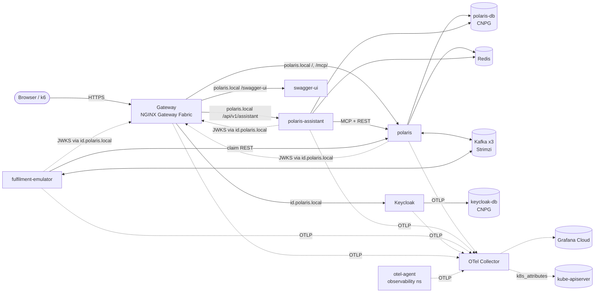

k8s# Kubernetes Deployment

- **Scope:** run the whole Polaris stack that `docker-compose.yml` runs today (gateway, Keycloak, PostgreSQL, Redis, Kafka, OTel Collector, `polaris`, `polaris-assistant`, `polaris-fulfilment-emulator`, Swagger UI) on Kubernetes
- **Target:** a local [kind](https://kind.sigs.k8s.io/) cluster first, with manifests that stay cloud-agnostic, so a cloud overlay is only a new overlay
- **Depends on:** — · **Unblocks:** a cloud environment plan (out of scope here)
- **Status:** Draft for review

## Goal

`make k8s-up` creates a local cluster and deploys the full stack. The same flows that work on Compose work on
Kubernetes: OIDC login through `https://id.polaris.local`, catalogue and order APIs and MCP through
`https://polaris.local`, assistant chat (SSE) through `/api/v1/assistant`, order events through Kafka to the
fulfilment emulator, and traces, metrics and logs reaching the OTel Collector with one `traceparent` from the
gateway down.

Compose stays the inner-loop dev environment. Kubernetes doesn't replace it in this plan. Compose and kind both bind host ports 80/443, so run one at a time (`KIND_CONFIG` overrides the kind ports for local runs).

## Technical Requirements

| ID | Requirement |
|:--|:--|
| TR-K1 | **Declarative and standard:** plain Kubernetes manifests composed with Kustomize (`base` + `overlays/local`). Third-party platform components are installed from their upstream Helm charts or operators at pinned versions, never forked or copied into the repo |
| TR-K2 | **Reproducible:** one command creates the cluster and deploys everything from a clean machine. Every image and chart version is pinned. Application images are tagged with the git SHA, never `latest` |
| TR-K3 | **Config as data (12-factor):** non-secret config in ConfigMaps, credentials in Secrets generated from an untracked env file (the same keys as `.env.template`). Exception: database credentials are operator-generated CNPG Secrets (`<cluster>-app`), not env-file keys. No credential is committed |
| TR-K4 | **Health-driven lifecycle:** each app has `startupProbe`, `livenessProbe` and `readinessProbe` on the existing `/actuator/health/{liveness,readiness}` groups, graceful shutdown (`server.shutdown=graceful`, a `preStop` drain and a matching `terminationGracePeriodSeconds`), and resource requests and limits |
| TR-K5 | **Multi-replica safe:** `polaris` and `polaris-assistant` run 2 replicas with a PodDisruptionBudget. Flyway migrations, the outbox relay and Kafka consumer groups stay correct when replicas start, stop or roll concurrently |
| TR-K6 | **Stateful parity:** PostgreSQL, Kafka (3-node KRaft, RF 3, min ISR 2, no topic auto-creation) and Keycloak keep their Compose semantics. Data survives pod restarts. Losing one Kafka node loses no `acks=all` write. Accepted deviation: Kafka runs 4.1.1 (Strimzi 0.49 supports only 4.0/4.1, and the pinned CRDs catalog limits Strimzi to 0.49); Compose moves to 4.1.x to match |
| TR-K7 | **Standard edge:** north–south traffic goes through the Gateway API (`Gateway` + `HTTPRoute`). TLS for `polaris.local`, `id.polaris.local` and `grafana.polaris.local` comes from cert-manager. SSE routes don't buffer and allow long-lived streams |
| TR-K8 | **One issuer:** tokens are issued and validated against the public issuer `https://id.polaris.local/realms/polaris`, both from browsers and from inside the cluster. Apps trust the cluster CA through a mounted truststore, not by running as root |
| TR-K9 | **Observable by default:** every app and the gateway export OTLP to an in-cluster OTel Collector. Telemetry carries Kubernetes resource attributes (`k8s.namespace.name`, `k8s.pod.name`, `k8s.deployment.name`). W3C trace context is continuous gateway → `polaris` → `polaris-assistant` (MCP) → Kafka → emulator |
| TR-K10 | **Least privilege:** the namespace enforces Pod Security `restricted`. Pods run non-root with a read-only root filesystem where possible. Accepted exception (K4): the `observability` namespace runs Pod Security `privileged` for the `otel-agent` log DaemonSet (read-only hostPath to the Gateway pod's logs, no token, no ports, all capabilities dropped), because NGF has no syslog or OTLP access-log output. Accepted trade-off (K7): the Keycloak Operator runs in `polaris` (upstream watches only its own namespace) and can read and write every Secret there. NetworkPolicies default-deny and allow only the flows listed in §Topology |
| TR-K11 | **Verified in CI:** every slice adds to an automated smoke test that runs against a kind cluster in GitHub Actions, on the same public interfaces used in production (HTTPS through the gateway, OIDC, Kafka) |

## Decisions (to confirm in K1's ADR)

| # | Decision | Default chosen | Why | Alternative |
|:--|:--|:--|:--|:--|
| D1 | Packaging for our apps | **Kustomize** | Ships with `kubectl`, no templating language, overlays map cleanly to environments | Helm umbrella chart |
| D2 | PostgreSQL | **CloudNativePG** operator, one `Cluster` per owner (`polaris-db`, `keycloak-db`) | Declarative backups (configured in K11), failover, standard Postgres images | Bitnami chart, plain StatefulSet |
| D3 | Kafka | **Strimzi** operator, KRaft `KafkaNodePool` of 3 dual-role nodes | Same topology as Compose (TR-B1); operator-managed rolling restarts | Bitnami chart |
| D4 | Keycloak | **Keycloak Operator** with `KeycloakRealmImport` for `polaris` (the master realm is imported by the server at first start with `--import-realm`, because the operator's import runs after the built-in master exists and skips it) (placeholders from a Secret for `DEFAULT_PASSWORD` and the emulator secret) | Production mode instead of `start-dev`; upstream-supported realm import | Plain Deployment with `--import-realm` |
| D5 | Gateway | **Gateway API** with **NGINX Gateway Fabric** | Gateway API is the standard successor to Ingress (ingress-nginx is retired); keeps nginx semantics and native OTel tracing | Envoy Gateway |
| D6 | TLS | **cert-manager** with a self-signed local root CA (`ClusterIssuer`), distributed to pods by **trust-manager** as a JKS and PKCS12 bundle (JKS is deprecated upstream) | Replaces the mkcert certificates and the hand-copied `truststore.jks` | Keep mkcert certs as static Secrets |
| D7 | In-cluster resolution of `id.polaris.local` | **CoreDNS rewrite** of `*.polaris.local` to the Gateway Service | Keeps one issuer (TR-K8) with no app change, same as the nginx alias on `polaris-net` | `hostAliases` per pod |
| D8 | Observability backend | **OTel Collector → Grafana Cloud** (already configured in `.env`). The local Prometheus, Loki, Tempo and Grafana move to K12 | Smallest working slice. The in-cluster LGTM stack is large and optional locally | Deploy LGTM charts from the start |
| D9 | Image registry | **GHCR**, pushed by CI. Local runs use `kind load docker-image` | No registry needed on the laptop | Local registry container |
| D10 | Kafka topics | **Stay provisioned by the owning service** at startup, as today. Strimzi's Topic Operator is disabled | No behaviour change; the topic contract stays with its owner | `KafkaTopic` CRs |

## Topology



The edges above are also the NetworkPolicy allow list (K11).

## Repository layout

```
deploy/k8s/
  kind/cluster.yaml                # kind config: ingress port mappings 80/443
  platform/                        # pinned Helm values and operator CRs (cert-manager, trust-manager,
                                   # gateway, CNPG, Strimzi, Keycloak operator, OTel Collector)
  base/
    namespace.yaml                 # Pod Security restricted
    polaris/ polaris-assistant/ polaris-fulfilment-emulator/ swagger-ui/ redis/
    data/ kafka/ keycloak/ edge/ observability/
  overlays/local/                  # image tags, replica counts, secretGenerator from deploy/k8s/.env.local
scripts/k8s/                       # up.sh, down.sh, smoke.sh, plus helpers: lib.sh, tools.sh, validate.sh
```

## Slices

### Slice Tracker

Slices run top to bottom; only the `execute-plan` coordinator edits this table.

| # | Slice | Title | Status | External | Branch | PR | Notes |
|:--|:--|:--|:--|:--|:--|:--|:--|
| 1 | K1 | Cluster bootstrap, layout and CI skeleton | `done` | Decisions D1–D10 confirmed | `k8s/k1-cluster-bootstrap` | [#2](https://github.com/vungdv/polaris-assistant/pull/2) | Merged 396851f |
| 2 | K2 | Application images in CI | `done` | GHCR package write permission on the repo | `k8s/k2-app-images` | [#3](https://github.com/vungdv/polaris-assistant/pull/3) | Merged de719a9. Flaky trunk tests fixed in #4 (0db2cf1) |
| 3 | K3 | Edge: TLS, Gateway and DNS | `done` | — | `k8s/k3-edge` | [#5](https://github.com/vungdv/polaris-assistant/pull/5) | Merged 23fdda9 |
| 4 | K4 | Observability pipeline | `done` | — | `k8s/k4-observability` | [#7](https://github.com/vungdv/polaris-assistant/pull/7) | Merged 8bfee4c |
| 5 | K5 | Data stores: PostgreSQL and Redis | `done` | — | `k8s/k5-data-stores` | [#9](https://github.com/vungdv/polaris-assistant/pull/9) | Merged 19f4d2e |
| 6 | K6 | Kafka cluster | `done` | — | `k8s/k6-kafka` | [#10](https://github.com/vungdv/polaris-assistant/pull/10) | Merged e399b54 |
| 7 | K7 | Identity: Keycloak | `done` | — | `k8s/k7-keycloak` | [#13](https://github.com/vungdv/polaris-assistant/pull/13) | Merged 7b51ebe |
| 8 | K8 | Order & Catalog (`polaris`) and Swagger UI | `done` | — | `k8s/k8-polaris` | [#16](https://github.com/vungdv/polaris-assistant/pull/16) | Merged 0f9dcfa |
| 9 | K9 | Assistant (`polaris-assistant`) | `done` | Gemini and TypeSafe API keys available to CI as secrets | `k8s/k9-assistant` | [#17](https://github.com/vungdv/polaris-assistant/pull/17) | Merged aac954d |
| 10 | K10 | Fulfilment (`polaris-fulfilment-emulator`) | `approved` | — | `k8s/k10-fulfilment` | [#18](https://github.com/vungdv/polaris-assistant/pull/18) | |
| 11 | K11 | Hardening: NetworkPolicies, autoscaling, disruption, backups | `todo` | — | | | |
| 12 | K12 | Local LGTM stack and runbook | `todo` | — | | | |

**Statuses:** `todo` → `in-progress` → `in-review` → `approved` (not merged) → `done` (merged), plus `blocked` (reason in *Notes*) and `dropped`.

### K1: Cluster bootstrap, layout and CI skeleton
**Covers:** TR-K1, TR-K2, TR-K11. **Detail design:** the ADR below.
- ADR-0021 *Kubernetes deployment platform* records D1–D10 and is proposed.
- `deploy/k8s/` layout as above, with an empty `polaris` namespace (Pod Security `restricted` labels) in `base`.
- `make k8s-up` creates a kind cluster from `deploy/k8s/kind/cluster.yaml` and applies `overlays/local`. `make k8s-down` deletes it. Both are idempotent.
- `scripts/k8s/smoke.sh` exists and checks the namespace. Later slices extend it.
- A new GitHub Actions job validates the rendered manifests (`kubectl kustomize` + `kubeconform` with CRD schemas), then runs `make k8s-up` and `smoke.sh` on a kind cluster.

### K2: Application images in CI
**Covers:** TR-K2, TR-K4 (image side).
- CI builds the three app images from their existing Dockerfiles and pushes `ghcr.io/<owner>/<app>:<git-sha>` on `main`. PRs build without pushing.
- The Maven CI job uses JDK 21, matching the Dockerfiles.
- The Dockerfiles drop `VOLUME /app/data`, which no app uses. The image runs as a numeric non-root UID so `runAsNonRoot` can verify it.
- All three apps set `server.shutdown: graceful` and `spring.lifecycle.timeout-per-shutdown-phase`. A test shows an in-flight request completes after shutdown starts.
- `make k8s-images` builds locally and runs `kind load docker-image`. The local overlay pins the tag.

### K3: Edge: TLS, Gateway and DNS
**Covers:** TR-K7, TR-K8 (CA and DNS), D5, D6, D7.
- cert-manager and trust-manager installed at pinned versions. A self-signed root `ClusterIssuer` issues one certificate for `polaris.local`, `id.polaris.local` and `grafana.polaris.local`.
- trust-manager publishes a `Bundle` with the root CA as PEM and JKS, ready for apps to mount (replaces `docker/nginx/truststore.jks`).
- NGINX Gateway Fabric installed. A `Gateway` with HTTPS listeners for the three hosts and an HTTP→HTTPS redirect.
- The CoreDNS rewrite resolves `*.polaris.local` to the Gateway Service inside the cluster.
- `scripts/setup-local-https-mac-m1.sh` gains a step that trusts the cluster root CA on the host.
- Smoke: from a pod, `https://polaris.local` resolves to the Gateway and the certificate verifies against the bundle. An unrouted path returns 404. NGF answers unmatched paths with 404, so no placeholder route is needed. Problem+json is not required at the edge.

### K4: Observability pipeline
**Covers:** TR-K9, D8.
- OTel Collector (upstream chart, contrib image) as a Deployment with OTLP gRPC and HTTP Services. Its config is ported from `docker/telemetry/otel-collector-config.yaml`, plus the `k8sattributes` processor (with its RBAC) and the Grafana Cloud exporter. Credentials come from a Secret. The Grafana Cloud exporter config is kept as is, but it is not a gate: CI runs without Grafana Cloud credentials and the smoke uses the debug exporter.
- The Gateway exports spans to the Collector and propagates `traceparent`. Its access logs stay JSON with `trace_id` and `span_id`.
- The nginx syslog access-log receiver is replaced by Collector log collection from the Gateway pod's stdout.
- Smoke: a request through the Gateway produces a span carrying `k8s.pod.name`, as seen in the Collector's debug exporter in CI.

### K5: Data stores: PostgreSQL and Redis
**Covers:** TR-K6 (PostgreSQL), D2.
- CloudNativePG operator. Two `Cluster`s, `polaris-db` (database `polaris`) and `keycloak-db` (database `keycloak`), on PostgreSQL 16, matching Compose. One instance each in the local overlay. Credentials are operator-generated Secrets.
- Redis 7 as a single-replica Deployment and Service with persistence off, matching Compose.
- Smoke: write a row, delete the primary pod, the row is still there. `redis-cli ping` answers from inside the namespace.

### K6: Kafka cluster
**Covers:** TR-K6 (Kafka), D3, D10.
- Strimzi operator. One `Kafka` in KRaft mode with a 3-node dual-role `KafkaNodePool`, an internal plaintext listener on 9092 (unauthenticated in dev, as TR-X1 allows today), and persistent storage.
- Cluster config matches Compose: `default.replication.factor=3`, `min.insync.replicas=2`, `auto.create.topics.enable=false`, offsets and transaction logs RF 3 / min ISR 2. The Topic Operator is disabled (D10).
- The `make kafka-*` admin targets get `k8s-kafka-*` equivalents that `kubectl exec` into a broker. Compose's host listener (`localhost:9094-9096`, used by `make run`) has no kind equivalent: `make run` against kind is not supported; use the `k8s-kafka-*` targets or `kubectl port-forward`.
- Smoke: create a test topic, delete one broker pod, an `acks=all` produce still succeeds, and the topic shows no data loss after the pod returns.

### K7: Identity: Keycloak
**Covers:** TR-K8 (issuer), D4.
- Keycloak Operator. A `Keycloak` CR in production mode on `keycloak-db`, hostname `https://id.polaris.local`, proxy headers `xforwarded`, and tracing to the Collector.
- `polaris-realm.json` via `KeycloakRealmImport`, and `master-realm.json` imported by the server at first start (`--import-realm`, from a ConfigMap), both with `DEFAULT_PASSWORD` and `POLARIS_FULFILMENT_EMULATOR_SECRET` as placeholders from a Secret. The realm files stay the single source in `docker/keycloak/`, referenced by the overlay, not copied.
- An `HTTPRoute` for `id.polaris.local`. Add each new `HTTPRoute` to `base/edge/tracing-policy.yaml` (NGF traces only routes in its `targetRefs`, at most 16).
- Smoke: OIDC discovery at `https://id.polaris.local/realms/polaris/.well-known/openid-configuration` returns that issuer, both from the host and from a pod. A password-grant token is issued for a seeded test user.

### K8: Order & Catalog (`polaris`) and Swagger UI
**Covers:** TR-K3, TR-K4, TR-K5, TR-K8, TR-K9 for the core context.
- Deployment (2 replicas), Service, ConfigMap and Secret that carry the env vars from the Compose `polaris` service, without dev-only flags (`SPRING_JPA_SHOW-SQL`, the JDBC bind logging). Datasource credentials come from the CNPG Secret. The truststore is mounted from the K3 bundle. Non-root, read-only root filesystem with an `emptyDir` for `/tmp`.
- Probes on `/actuator/health/liveness` and `/actuator/health/readiness`, a `startupProbe` that covers Flyway, and a `preStop` drain. PodDisruptionBudget `minAvailable: 1`.
- `HTTPRoute`s on `polaris.local` for `/` and for `/mcp/` (SSE: no buffering, long request timeout). Swagger UI Deployment and route for `/swagger-ui`, with the same spec URLs as Compose. Add each new `HTTPRoute` to `base/edge/tracing-policy.yaml` (NGF traces only routes in its `targetRefs`, at most 16).
- Verified with 2 replicas starting at once: Flyway applies each migration exactly once. The outbox relay hands off each event once, in per-key order (re-runs the E3 two-instance guarantee on the cluster). A rolling restart under `tests/perf/api-test.js` load returns no 5xx.
- Smoke: `tests/perf/api-test.js` passes against `https://polaris.local`, and a request trace shows Gateway and `polaris` spans in one trace.

### K9: Assistant (`polaris-assistant`)
**Covers:** TR-K3, TR-K4, TR-K5, TR-K9 for the assistant context.
- Deployment (2 replicas), Service, ConfigMap and Secret mapped from the Compose service. `POLARIS_MCP_CORE_URL` and `POLARIS_CORE_API_BASE_URL` point at the `polaris` Service. `GEMINI_API_KEY`, `TYPESAFE_API_KEY` and the `AGENTO11Y_*` settings come from the Secret.
- A `wait-for-polaris` init container holds the assistant until `polaris` is ready, the Kubernetes equivalent of Compose's `depends_on: polaris: service_healthy`. It keeps the assistant's Hibernate `ddl-auto: update` from creating tables before polaris's Flyway migrates an empty database.
- Readiness keeps today's semantics: it checks db and `polarisMcp` only, so Gemini or TypeSafe outages never take pods out of the Service.
- `HTTPRoute`s for `/api/v1/assistant` (SSE) and `/v3/api-docs/assistant`. `terminationGracePeriodSeconds` covers the turn time budget, so a rolling restart doesn't cut an in-flight SSE turn. Add each new `HTTPRoute` to `base/edge/tracing-policy.yaml` (NGF traces only routes in its `targetRefs`, at most 16).
- The assistant's sessions and order drafts survive a replica switch mid-conversation (JPA session store + Redis intents). Verified by pinning consecutive turns to different pods.
- Smoke: `make seed-shoppers` (with `KC_ADMIN_USER`/`KC_ADMIN_PASSWORD` from Secret `keycloak-initial-admin`, the operator's bootstrap admin, not Compose's `admin`/`admin`) and `make chat-scenarios` pass through the Gateway, and one trace spans Gateway → assistant → `polaris` (MCP).
- Risk, out of scope: the assistant uses `ddl-auto: update` on the shared database. That conflicts with forward-only migrations and becomes riskier with multiple replicas: on first deploy both replicas run `ddl-auto: update` at once and can race on `CREATE TABLE` (one pod crashes and recovers on restart). Raised as a follow-up, not fixed here.

### K10: Fulfilment (`polaris-fulfilment-emulator`)
**Covers:** TR-K3, TR-K4, TR-K9 for the fulfilment context.
- Deployment (1 replica, as today: one consumer group per partner) with no `HTTPRoute`, so actuator is in-cluster only. Kafka bootstrap points at the Strimzi bootstrap Service. The token endpoint goes through `id.polaris.local`, and the client secret comes from the shared Secret used by the realm import. The client secret is read from Secret `keycloak-realm-placeholders` (never the Compose default), and `POLARIS_FULFILMENT_EMULATOR_SECRET` is added to `.env.template`.
- A `wait-for-polaris` init container, as in K9, mirrors Compose's `depends_on: polaris: service_healthy`: polaris provisions the order lifecycle topic (D10) and serves the claims.
- Smoke: `tests/e2e/run-fulfilment.sh` runs against the cluster: an order placed through the Gateway reaches `DELIVERED` with an assigned partner, its five `order.*.v1` events are on `polaris.order.lifecycle` in order, and one trace continues across Kafka.

### K11: Hardening: NetworkPolicies, autoscaling, disruption, backups
**Covers:** TR-K5, TR-K10, D2 (backups).
- A default-deny NetworkPolicy for the namespace, plus allow rules for exactly the edges in §Topology (including the Keycloak operator → kube-apiserver, the realm-import Job → `keycloak-db`, only the NGF data plane → Keycloak:8080, `otel-agent` → Collector, the NGF data plane → Collector, and Collector → kube-apiserver), DNS, and egress to Gemini, TypeSafe and Grafana Cloud.
- HPA on CPU for `polaris` and `polaris-assistant` (min 2, max 4 locally). metrics-server installed in kind.
- Every pod passes Pod Security `restricted`, which the namespace has enforced since K1 (TR-K10).
- CNPG backups for `polaris-db` and `keycloak-db`: a `ScheduledBackup` plus continuous WAL archiving to an in-cluster S3-compatible object store (pinned upstream chart, credentials from a Secret). Smoke: a backup completes, and a new `Cluster` bootstrapped from it (recovery) contains the smoke row.
- Smoke: a pod outside the allow list can't reach `polaris-db` or Kafka. Draining a kind node during `api-test.js` keeps the error rate at 0, thanks to the PDBs.

### K12: Local LGTM stack and runbook
**Covers:** TR-K9 (local parity with Compose dashboards), D8 follow-up.
- Optional `overlays/local-lgtm` component: Prometheus, Loki, Tempo and Grafana from upstream charts, configured from the existing files under `docker/telemetry/` (dashboards, SLO rules, datasources). Grafana SSO through the Keycloak master realm, as in Compose. `HTTPRoute` for `grafana.polaris.local`. The K3 Gateway listeners accept routes from the `polaris` namespace only, so Grafana in another namespace needs `allowedRoutes` widened for its listener.
- The Collector fans out to both the local stack and Grafana Cloud when the component is enabled. NGF parity gaps vs the Compose nginx: no `stub_status` (use NGF's Prometheus metrics on port 9113 instead), no `route`/`sse` access-log fields, and no `url.path` on gateway spans. Dashboards and SLO rules are adjusted for these. Add each new `HTTPRoute` to `base/edge/tracing-policy.yaml` (NGF traces only routes in its `targetRefs`, at most 16).
- `make test-rules` still passes against the same rule files.
- `docs/operations/k8s-runbook.md`: bring up, tear down, secrets (Keycloak bootstrap admin in `keycloak-initial-admin`; Grafana SSO uses `grafana-admin` with `DEFAULT_PASSWORD`), image reload, Kafka and Postgres admin, rolling restart, troubleshooting. The root README links it.

## Definition of Done

- [ ] `make k8s-up` on a clean machine deploys the full stack, and `scripts/k8s/smoke.sh` passes. The same runs in CI on every PR.
- [ ] API, chat and fulfilment e2e suites pass against `https://polaris.local` on the cluster.
- [ ] A single trace spans Gateway → `polaris` → `polaris-assistant` → Kafka → emulator.
- [ ] A rolling restart of every app and the loss of one Kafka broker cause no request errors and no lost events.
- [ ] No credential is committed, and every pod passes Pod Security `restricted`.
- [ ] ADR-0021 is accepted.

## Change Log

| Date | Change | Reason | Slices affected |
|:--|:--|:--|:--|
| 2026-10-06 | Fixed slice references: D8 now points to K12 for the local LGTM stack, §Topology to K11 for NetworkPolicies | Stale numbering from an earlier draft | K11, K12 |
| 2026-10-07 | K11: Pod Security `restricted` is enforced from K1, K11 only checks every pod passes. Goal: Compose and kind can't run together (both bind 80/443). Layout: `scripts/k8s/` helpers listed. K2: dropped stale "today it uses 17" | Found while implementing and reviewing K1 and K2 | K1, K2, K11 |
| 2026-10-07 | K4 no longer gated on Grafana Cloud OTLP credentials in CI; the exporter config is kept as is. K3: smoke checks an unrouted path returns 404 (no placeholder route). D6: bundle is JKS and PKCS12. K12: note on Gateway `allowedRoutes` for Grafana | User decision on the K4 gate; findings from the K3 review | K3, K4, K12 |
| 2026-10-07 | K7, K8, K9, K12 add their routes to the NGF tracing policy. K12 accounts for NGF parity gaps (stub_status, route/sse log fields, url.path). TR-K10 records the `observability` namespace as an accepted exception. §Topology and K11 add the otel-agent, gateway and kube-apiserver telemetry edges | Findings from the K4 review | K7, K8, K9, K11, K12 |
| 2026-10-07 | TR-K3 names operator-generated CNPG credentials as an exception. D2 backups are now delivered: K11 adds CNPG scheduled backups and WAL archiving to an in-cluster object store, with a restore check | Findings from the K5 review | K11 |
| 2026-10-07 | TR-K6 records Kafka 4.1.1 on Kubernetes as an accepted deviation; Compose moves to 4.1.x in a separate change. K6 documents that there is no host Kafka listener on kind | Findings from the K6 review | K6 |
| 2026-10-08 | D4/K7: master realm imported by the server at first start; only polaris uses KeycloakRealmImport. K9 seed-shoppers and K12 runbook use the operator bootstrap admin and grafana-admin. K10 reads the emulator secret from keycloak-realm-placeholders and adds it to .env.template. K11 adds Keycloak operator, import Job and NGF→Keycloak edges; TR-K10 records the operator Secret access as accepted | Findings from the K7 review | K7, K9, K10, K11, K12 |
| 2026-10-10 | K9 records the `wait-for-polaris` init container (Compose `depends_on: service_healthy` equivalent, orders `ddl-auto` after Flyway). The `ddl-auto` follow-up risk adds the two-replica first-start `CREATE TABLE` race | Findings from the K9 review | K9 |
| 2026-10-10 | K10 smoke checks `DELIVERED` plus the five `order.*.v1` events (there is no `DISPATCHED` status). K10 records the `wait-for-polaris` init container | Findings from implementing and reviewing K10 | K10 |
