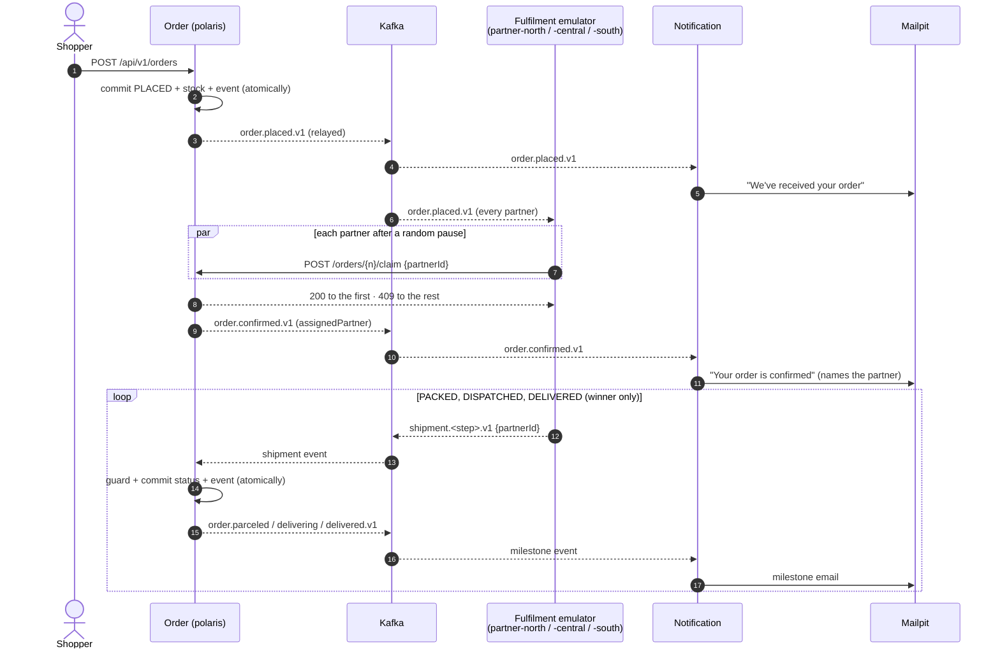

# Programme: Order Notifications & Multi-Partner Fulfilment

- **Requirement:** [PRD-007](../../../business/prds/PRD-007-order-notifications-and-fulfilment-emulator.md): *"Follow my order"*, from placement to delivery, with one shopper email per milestone and orders claimed first-wins by one of several fulfilment partners
- **Design baseline:** [EM-002](../../../technical/event-models/EM-002-order-lifecycle-notifications-and-fulfilment.md). §3 lists where this programme departs from it.
- **Runs alongside:** [`shopper-search-and-order-placement-gaps.md`](../shopper-search-and-order-placement-gaps.md). See §6.
- **Code verified against:** `main` @ `850cd6a` (2026-09-29)
- **Status:** Draft for review

This is the umbrella document. It holds what the four plans share: traceability, departures from EM-002, cross-cutting requirements, decisions and the overall Definition of Done. It has no slices. Run each plan with `execute-plan`, **in order**:

| # | Plan | Delivers | Depends on |
|:--|:--|:--|:--|
| 1 | [Outbox & generic event publishing](01-outbox-event-publishing.md) | Any change in a context with a DB can raise events that are stored atomically and relayed reliably through a transport port. Order records `order.placed` | — |
| 2 | [Message broker infrastructure](02-message-broker.md) | Kafka in the platform and a Kafka transport for the relay: `order.placed.v1` is on Kafka as a CloudEvent | Plan 1 |
| 3 | [Multi-partner fulfilment](03-fulfilment-emulator.md) | Partners claim orders first-wins and drive them to `DELIVERED`, with milestone events | Plan 2 |
| 4 | [Notification](04-notification.md) | One email per milestone in Mailpit; full journey in one trace | Plan 2 (full journey needs Plan 3) |

Each plan is **what, not how**: technical requirements and acceptance criteria. Slices marked *Detail design: required* start with a design note at `docs/development/design/order-notifications-and-fulfilment/<slice>.md` as the first commit on the slice branch; the PR is reviewed against it.

---

## 1. Traceability

| PRD-007 | Plan |
|:--|:--|
| FR-1 Offer to all partners | 1 (raise), 2 (deliver), 3 (consume) |
| FR-2 First partner to accept wins | 3 |
| FR-3 Milestones announced once, after save | 1 (atomic, no loss), 2 (on Kafka), 3 (confirmed & shipment milestones) |
| FR-4 Multi-partner emulator | 3 |
| FR-5 Status follows the assigned partner | 3 |
| FR-6 Email per milestone via Mailpit | 4 |
| FR-7 One journey, one trace | 1 (capture), 2 (across Kafka), 3, 4 (end-to-end check) |
| Scenarios 1, 3, 8 | 4 |
| Scenarios 2, 4–7 | 3 |

Reused as-is: statuses `PLACED…DELIVERED` (code and DB `CHECK`), `Customer.email`, row-locked `placeOrder`, OTLP pipeline to Tempo/Loki/Prometheus/Grafana, Keycloak JWT → `PERM_*` mapping.

---

## 2. Target Flow

---

## 3. Departures from EM-002

EM-002 was written when **staff** confirmed orders; PRD-007 has **partners** claim them. Plan 4's last slice brings EM-002 up to date.

| # | Change | Why | Plan |
|:--|:--|:--|:--|
| Δ1 | Partners **claim** an order over REST; staff no longer confirm | FR-2 | 3 |
| Δ2 | Fulfilment consumes **`order.placed.v1`** as the offer; the winner learns it won from the claim response | FR-1, FR-4 | 3 |
| Δ3 | The order records its assigned partner and claim time (schema change) | FR-2 | 3 |
| Δ4 | Shipment and order lifecycle events carry the partner | FR-5, FR-6 | 1 (contracts) |
| Δ5 | Event contracts live in a new dependency-free library, not `polaris-common` | `polaris-common` needs a datasource; the new apps are stateless | 1 |
| Δ6 | A dedicated `409 order-not-claimable` problem type | The shared `IllegalStateException` handler is cancellation-specific | 3 |
| Δ7 | Cancellation must serialize with claims on the same order | Today's unlocked cancel can race a claim into a lost update | 3 |
| Δ8 | **Transactional outbox** replaces "send after commit"; delivery becomes at-least-once with no loss | EM-002 §6 accepted lost events; a lost `order.placed` means no partner ever claims the order | 1, 2 |

---

## 4. Cross-Cutting Requirements (TR-X)

Every plan meets these; plans reference them by ID.

| ID | Requirement |
|:--|:--|
| TR-X1 | **Security:** OAuth 2.0 / Keycloak only; new permissions and service clients are declared in the realm export; secrets come from env. Kafka is unauthenticated in dev (internal emulator only) |
| TR-X2 | **Observability** (ADR-0016): W3C trace context across HTTP and messaging; structured logs with `trace_id` plus business keys (`orderNumber`, `ce_id`); invocation, outcome and latency metrics for every new entry point |
| TR-X3 | **Platform:** new services and modules run in `docker compose` with pinned images and healthchecks, and build in every existing Dockerfile |
| TR-X4 | **Data:** forward-only Flyway migrations. Reserved: **V15** (Plan 1), **V16** (Plan 3). Plan 1 may add `V15_x` sub-versions (never edit a merged V15); they must be applied before V16 exists in any environment (`outOfOrder=false`) |
| TR-X5 | **Testing:** integration tests use real infrastructure (Postgres, Kafka, Mailpit via Testcontainers); stubs only at external boundaries |
| TR-X6 | **Contracts:** REST in OpenAPI with Problem Details errors; events are CloudEvents 1.0, keyed by aggregate id, additive-only within a `.vN` type |
| TR-X7 | **Event-raising state changes:** an aggregate's status changes only through its own methods, which register the domain event; no public status setters, and no bulk or `@Modifying` status updates. Tests assert exactly one event per transition |
| TR-X8 | **Serialised per key:** once an aggregate exists, every transaction that raises an event for it is mutually exclusive with the others: it locks the aggregate (`SELECT … FOR UPDATE`) before recording any event, or the aggregate is versioned (`@Version`) so a concurrent loser rolls back. Creation needs nothing beyond the insert, because the creation event is the first event of a new key. Otherwise a lower outbox id can commit after a higher one has been relayed, breaking per-key order (TR-E3). Tests show concurrent same-key changes cannot commit events out of id order |

---

## 5. Decisions

| ID | Question | Decision | Plan |
|:--|:--|:--|:--|
| D1 | Partner claim: REST or Kafka command? | **REST.** First-wins needs a synchronous yes/no per partner; Kafka would need a correlated reply topic | 3 |
| D2 | Shipment reports to Order: Kafka or REST? | **Kafka** (EM-002). Decouples Fulfilment from Order's uptime; `partnerId` is unauthenticated (TR-X1) | 3 |
| D3 | Every partner sees every offer: per-partner consumer group or in-process fan-out? | **Per-partner group.** Correct Kafka model, unchanged if partners become separate deployments | 3 |
| D4 | Repeat claim by the winner: `409` or idempotent `200`? | **`409`** (PRD FR-2). The emulator never retries; revisit for real partners | 3 |
| D5 | Does a late cancellation stop the emulator? | **No** (PRD-007 §6.5). Order ignores the reports | 3 |
| D6 | Transactional outbox now? | **Yes** (2026-09-29). Reliability, and one publishing path for every future event | 1 |
| D7 | Outbox relay: in-app or CDC (Debezium)? | **In-app relay** behind a transport port. No new infrastructure; CDC can replace it later without changing producers | 1, 2 |
| D8 | Split into four plans? | **Yes** (2026-09-29). Outbox proven before the broker exists; each plan ships and demos on its own | all |

---

## 6. Coordination with the Shopper-Search Gaps Plan

| Shared item | Rule | Plan |
|:--|:--|:--|
| Flyway | V12–V14 are on `main` (`850cd6a`). Re-check V15/V16 at merge (`outOfOrder=false`) | 1, 3 |
| `OrderService.placeOrder` | Raising `order.placed` lands **after** gaps S4, so S4's concurrent-duplicate replay path is covered by "replay announces nothing" | 1 |
| `OrderService.cancelOrder` | S4 cache eviction and the claim/cancel serialization: merge by hand | 3 |
| `OrderController`, `OrderResponse`, `OrderMcpTools`, `GlobalExceptionHandler` | Both plans only add; rebase | 3 |
| Order numbers | Event key = order number, so it must be unique (S4's DB sequence) | 2 |

---

## 7. Out of Scope

Everything in PRD-007 §6, plus:
- Authenticated per-partner Kafka producers (SASL/mTLS, ACLs) and a schema registry.
- Consumer-side dedupe in Notification (duplicate emails accepted; `ce_id` makes it addable later).
- CDC for the outbox, and a dead-letter state for events that never send (they retry and alert instead).
- Mailpit UI behind nginx/`polaris.local`; milestones in the Assistant chat (PRD-007 §6.9).

---

## 8. Programme Definition of Done

- [ ] Plans 1–4 are complete, each meeting its own Definition of Done.
- [ ] PRD-007 Scenarios 1–7 pass as automated tests; Scenario 8 is verified manually and recorded in `tests/e2e/README.md`.
- [ ] `docker compose up` starts everything; one placed order yields 5 emails in Mailpit in under a minute.
- [ ] `mvn clean test` passes across the reactor.
- [ ] EM-002 is as-built; ADR-0018 (outbox) and ADR-0019 (Kafka & CloudEvents) are accepted.

---

## 9. Change Log

Programme-level changes (plan split, cross-cutting requirements, decisions), newest first. Each plan logs its own changes.

| Date | Change | Reason | Plans affected |
|:--|:--|:--|:--|
| 2026-09-29 | Split the single plan into this umbrella and four plans: outbox, message broker, fulfilment, notification. Slice IDs are now prefixed per plan (`E`, `B`, `F`, `N`) | Smaller, independently shippable plans; outbox proven before the broker | all |
| 2026-09-29 | Rewrote the plan as technical requirements with acceptance criteria; implementation detail moved to per-slice detail designs | Keep plans concise and implementation-agnostic | all |
| 2026-09-29 | Replaced after-commit publishing with domain events + a generic publisher over a transactional outbox; D6 → yes, D7 added | Reliability: no lost or phantom events; one publisher for any event type | 1, 2 |
| 2026-09-28 | Added the Slice Tracker and Change Log | Track slice-by-slice execution with `execute-plan` | — |
