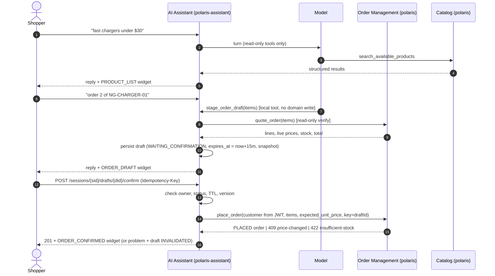
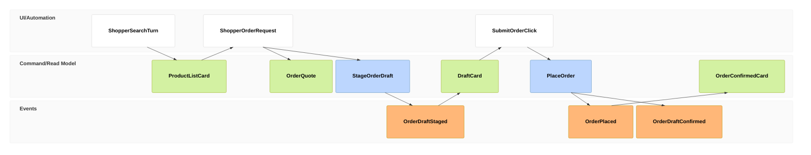
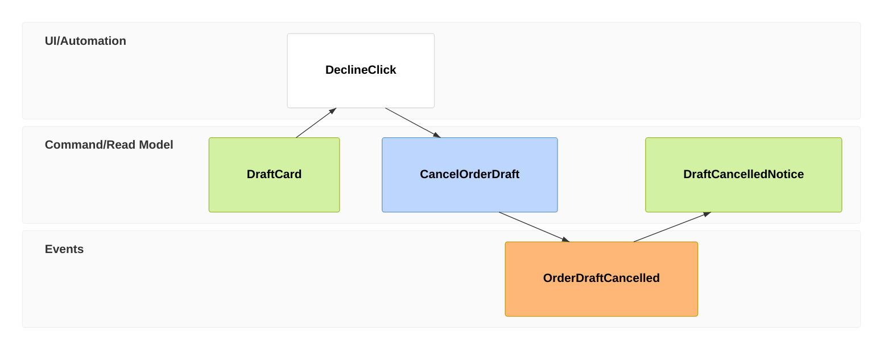
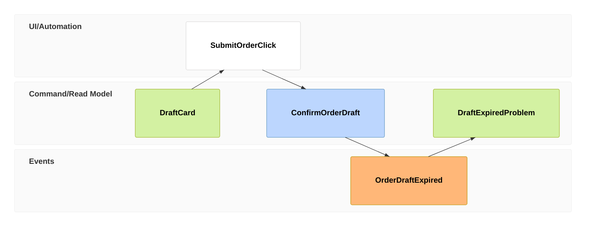
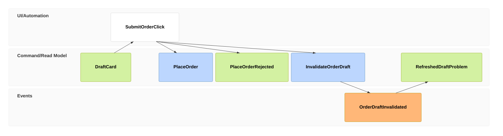

# Plan: Close Implementation Gaps — Shopper Search & Order Placement

- **Process:** [`shopper-search-and-order-placement.bpmn`](../../business/bpmn/shopper-search-and-order-placement.bpmn) — *"How does a shopper search for a product and place an order with the help of an AI Assistant?"*
- **Sources:** [PRD-003](../../business/prds/PRD-003-web-chat-ai-assistant.md) FR-1, FR-3, FR-4, FR-10, FR-12, FR-14; [ADR-0004](../../technical/decisions/0004-web-chat-ai-assistant-architecture.md) §1.B, §2.C, §3; [EM-001](../../technical/event-models/EM-001-order-staging-out-of-stock-exception.md) §3
- **Code verified against:** `main` @ `d364361` (2026-09-28)
- **Status:** Draft for review

---

## 1. BPMN Step → Implementation Traceability

| # | BPMN element (lane) | Status | Evidence |
|:-:|:---|:---:|:---|
| 1 | `S_Ask` Ask assistant to find a product (Shopper) | ✅ Built | `POST /api/v1/assistant/chat` — `AssistantChatController.java` |
| 2 | `A_Intent` Understand shopper's request (AI Assistant) | ⚠️ Partial | Intent classified via TypeSafe + `intents.json`; entities left to model tool args. **Low-confidence fallback opens every tool with no scope check** (G2) |
| 3 | `C_Search` Search products & verify live stock (Catalog) | ⚠️ Partial | `search_available_products` defaults `available_only=true` and hits the DB. But `get_product_by_sku` reads a 10-min cache that placing an order never evicts, so the stock it shows can be stale (G11) |
| 4 | `A_Present` Render product cards (AI Assistant) | ❌ Missing | MCP tools return prose; `ChatMessageResponse` has only `reply` text — no card payload (G8) |
| 5 | `S_Review` / `S_Request` Review & ask to order (Shopper) | ✅ Built | Free-text chat |
| 6 | `A_Stage` Stage order draft, price held 15 min (AI Assistant) | ❌ Missing | No draft, no TTL, no snapshot. Draft/session tables are commented out in `V6__assistant_session_draft_schema.sql`; history lives in an in-memory `ConcurrentHashMap` (`AssistantChatService.java:58`) (G4) |
| 7 | `O_Verify` Re-verify stock & price (Order Management) | ❌ Missing | `OrderService.placeOrder` only verifies **and** commits in one step; no read-only check exists (G5) |
| 8 | `A_Draft` Present draft card (AI Assistant) | ❌ Missing | Depends on 6–7 (G4, G8) |
| 9 | `A_Gate` Customer confirms order? (AI Assistant) | ❌ **Missing — critical** | `place_order` is a model-callable tool under intent `commerce.order.place` (`intents.json`). The model can place an order in the same turn with no human click (G1) |
| 10 | `S_Confirm` Click "Submit Order" (Shopper) | ❌ Missing | No confirm endpoint (ADR-0004 §1.B `POST …/drafts/{draftId}/confirm` not built) (G1) |
| 11 | `A_Execute` Execute order with Idempotency-Key (AI Assistant) | ⚠️ Partial | Key is optional and model-supplied (`OrderMcpTools.java:440`). Concurrent duplicates race past the lookup and hit the unique index → generic error, not the original order (G7) |
| 12 | `O_Create` Create order & deduct stock (Order Management) | ⚠️ Partial | PLACED + atomic deduct with row locks ✅. Uses live price at commit — no check against the price the shopper saw (G6). Customer comes from model args, not the shopper's identity (G3). Order number from an in-memory counter (G10) |
| 13 | `A_ConfirmCard` Render confirmed order card (AI Assistant) | ❌ Missing | Prose only (G8) |
| 14 | `A_EndDeclined` Draft cancelled or expired (AI Assistant) | ❌ Missing | No cancel-draft endpoint, no expiry; `DraftExpiredException` is handled in `GlobalExceptionHandler` but never thrown (G9) |

---

## 2. Gap Register

| ID | Severity | Gap | BPMN element(s) | Requirement |
|:--|:--:|:--|:--|:--|
| **G1** | 🔴 Critical | No human confirmation gate — the model calls `place_order` directly | `A_Gate`, `S_Confirm` | FR-3 |
| **G2** | 🔴 Critical | When intent confidence is below threshold, `DefaultIntentResolver.java:66` passes **all** tools and `PolicyToolManager.java:215-218` accepts any of them; the empty `IntentDefinition` has `requiredScope=null`, so `DefaultPolicyEngine.java:30` allows without a scope check. A vague "yes do it" can place an order with no `order.write` check | `A_Intent`, `A_Gate` | FR-3, ADR-0004 §2 |
| **G3** | 🔴 Critical | Shopper identity isn't bound. `place_order` takes `customer_id`/`customer_name` from the model, so a shopper (`ROLE_USER`) can order for any customer. There is no link between the JWT subject and `customers` | `O_Create` | FR-10 (anti-IDOR) |
| **G4** | 🟠 High | No persisted order draft (15-min TTL, price snapshot, `@Version`) and no persisted session; history is lost on restart, not shared across instances, and grows without bound | `A_Stage`, `A_Draft` | FR-12, FR-14, ADR-0004 §3 |
| **G5** | 🟠 High | No read-only "check stock & price" operation in Order Management | `O_Verify` | FR-14 |
| **G6** | 🟠 High | Placing the order doesn't compare the live price with the price the shopper confirmed, so the total can change silently | `O_Create` | FR-14 |
| **G7** | 🟡 Medium | Idempotency: optional, model-generated key; the duplicate race surfaces as a generic error; the key isn't bound to its customer (another caller's key returns someone else's order) | `A_Execute` | FR-4 |
| **G8** | 🟡 Medium | No structured cards (product list, draft, confirmed order). MCP results are plain text; the response DTO has no widget field | `A_Present`, `A_Draft`, `A_ConfirmCard` | PRD-003 §3.1, §3.4 |
| **G9** | 🟡 Medium | No decline or expiry path for drafts | `A_EndDeclined` | FR-3, FR-14 |
| **G10** | 🟢 Low | `ORDER_COUNTER` (`OrderService.java:33`) is seeded from the clock per JVM, so numbers can collide across restarts or replicas → unique violation on `order_number` | `O_Create` | — |
| **G11** | 🟢 Low | `OrderService` deducts and restores stock via `ProductRepository` directly (`OrderService.java:106`), bypassing the `@CacheEvict` on `ProductService`. `get_product_by_sku` (`@Cacheable`, `ProductService.java:93`, remote TTL 10 min) then shows stale stock | `C_Search` | FR-1 |

---

## 3. Target Flow



### 3.1 Event Model — Happy Path (target)

Notation follows [`event-models/README.md`](../../technical/event-models/README.md#notation). An `evt` is a durable fact committed to the database, and `->> NN` names the event a view is built from. A `rmo` with no `->>` is a live query, or a rejection that changed nothing.



| Frame | What it is | BPMN element | Owner | Slice |
|:--|:--|:--|:--|:--|
| 01–02 | Chat turn → `search_available_products` live query, rendered as a `PRODUCT_LIST` widget. No event: nothing changes | `S_Ask` → `A_Intent` → `C_Search` → `A_Present` | Catalog / Assistant | S1, S8 |
| 03–04 | Shopper asks to order. The *Given* for staging is `OrderQuote` from the read-only `quote_order`: live price and stock per line | `S_Request` → `O_Verify` | Order Management | S3 |
| 05–06 | `StageOrderDraft` (model-callable local tool) commits an `assistant_order_drafts` row: `WAITING_CONFIRMATION`, price snapshot, `expires_at = +15 min`, customer taken from the JWT | `A_Stage` | Assistant | S2, S5, S6 |
| 07 | `ORDER_DRAFT` widget (items, total, expiry) built from the staged draft | `A_Draft` | Assistant | S6 |
| 08 | The only trigger that can lead to an order: an explicit click → `POST …/drafts/{draftId}/confirm` | `A_Gate` → `S_Confirm` | Shopper | S7 |
| 09 | The **orchestrator** (never the model) issues `PlaceOrder` from the draft snapshot: `expectedUnitPrice` per line, `Idempotency-Key = draftId`. The *Given* is the draft itself: owner, status, TTL, `@Version` | `A_Execute` | Assistant → Order Management | S4, S7 |
| 10 | `orders` row in `PLACED` plus stock deduction, in one transaction under row locks | `O_Create` | Order Management | S4 |
| 11 | Draft → `CONFIRMED` with `confirmed_order_number`. A repeated confirm replays this instead of placing again | `A_Execute` | Assistant | S7 |
| 12 | `ORDER_CONFIRMED` widget built from the placed order | `A_ConfirmCard` → `S_End` | Assistant | S7 |

### 3.2 Event Model — Draft Does Not Become an Order (target)

These are the three ways the flow leaves the happy path after the draft card (frame 07 above). Each timeline starts from the draft card.

**A. Shopper declines** (`A_Gate` → "No" → `A_EndDeclined`):



`CancelOrderDraft` comes from either `POST …/drafts/{draftId}/cancel` or the model's `discard_order_draft` tool. That's safe for the model because it doesn't change domain data (S6, S7).

**B. Draft expires before confirmation** (`A_EndDeclined`, expired case):



The confirm arrives after `expires_at`, so the draft moves to `EXPIRED` (a real state change, hence an `evt`), and `DraftExpiredException` → 409 `draft-expired`. `PlaceOrder` is never issued (S7).

**C. Price or stock changed between staging and confirmation** (PRD-003 Scenario 11):



Order Management rejects `PlaceOrder` under row lock with 409 `price-changed` or 422 `insufficient-stock`. The transaction rolls back, so there's no order and no stock change. That's why frame 04 is a bare `rmo`. The Assistant then records the draft as `INVALIDATED` and returns the problem so the shopper can review a refreshed draft (S4, S7). The out-of-stock remedies on that problem card are covered by [EM-001](../../technical/event-models/EM-001-order-staging-out-of-stock-exception.md).

Principles applied:
- **The model never mutates.** The model can only *stage* or *discard* a draft. Placing the order happens only through the REST confirm endpoint, which the orchestrator executes (ADR-0004 §1.B).
- **Each context owns its rules.** Price/stock verification and the price guard live in Order Management; the draft lifecycle lives in the Assistant context (AGENTS.md Principle 2.2).
- **Identity comes from the server.** For `ROLE_USER` the customer is resolved from the JWT and enforced in Order Management (defense in depth), not trusted from tool args.

---

## 4. Implementation Slices

Each slice is one vertical change within a single bounded context (AGENTS.md Principle 2). Suggested order and dependencies:

```
S1 ──────────────────────────────────────────────┐
S2 ──┐                                            │
S3 ──┼──► S6 (stage draft) ──► S7 (confirm gate) ─┴─► S9 (docs)
S4 ──┘        ▲                    ▲
S5 ───────────┘                    │
S8 (product cards) ────────────────┘ (widget plumbing reused)
```

### S1 — Close the low-confidence tool bypass *(Assistant; G2)* — ship first
**Files:** `intent/DefaultIntentResolver.java`, `tools/PolicyToolManager.java`, `intents.json`, `config/AssistantAiProperties.java`
1. Below threshold, fall back to **read-only tools only**: the union of `allowedTools` from intents with `mutating=false`. Never the full tool list.
2. Replace the per-intent scope check with a per-**tool** scope map derived from `intents.json` (tool → `requiredScope`), so an empty or low-confidence intent can't skip authorization.
3. Tighten the default system prompt: only use tool data for products, prices and stock (FR-1); never say an order is placed unless a tool confirmed it.

**Tests:** `DefaultIntentResolverTest` (low confidence excludes `place_order` and `cancel_order`), `ExternalToolManagerTest` (a tool whose scope is missing is denied under the empty intent).
**Note:** `place_order` stays model-callable until S7 lands, so ordering keeps working in the meantime. S7 removes it.

### S2 — Bind shopper identity to a customer *(Order Management; G3)*
**Files:** new `V12__add_customer_auth_subject.sql`, `order/entity/Customer.java`, `order/service/CustomerService.java`, `order/web/controller/CustomerController.java`, `order/web/controller/OrderController.java`, `mcp/OrderMcpTools.java`
1. Migration: `customers.auth_subject VARCHAR(64) UNIQUE NULL`, and backfill seeded customers to match `docker/keycloak/polaris-realm.json` users.
2. `GET /api/v1/customers/me` resolves by JWT `sub`, falling back to the `email` claim (see D1) → 404 problem if no customer is linked.
3. Enforce in `POST /api/v1/orders` and in the `place_order` MCP tool: a caller without a staff role (`ROLE_STAFF` or `ROLE_ADMIN`) always gets the customer from `/me`. A supplied `customer_id` that doesn't match → 403 problem.

**Tests:** `OrderApiIntegrationTest` (shopper ordering for another customer → 403; staff → 201), `CustomerController` `/me` test, `McpServerTest`.

### S3 — Read-only stock & price verification *(Order Management; G5)*
**Files:** new `order/dto/QuoteRequest.java` / `QuoteResponse.java`, `order/service/OrderQuoteService.java`, `OrderController.java` (`POST /api/v1/orders/quote`), `mcp/OrderMcpTools.java` (`quote_order` tool), `mcp/McpServerConfig.java`
1. For each line, return: SKU, name, **live** unit price, available stock, line total, and a per-line problem (`not_found`, `inactive`, `insufficient_stock`, with requested/available). Also return the grand total. No locks, no writes.
2. Return `structuredContent` in the MCP result (JSON matching `QuoteResponse`) plus a short text summary.
3. Read directly from the DB, not the product cache (FR-1).

**Tests:** service unit tests (all-ok, short stock, unknown SKU), REST integration test, MCP tool test. The endpoint is idempotent `POST` with no state change.

### S4 — Price guard, idempotency hardening, order numbers, cache eviction *(Order Management; G6, G7, G10, G11)*
**Files:** `order/dto/OrderItemRequest.java`, `order/service/OrderService.java`, new `web/exception/PriceChangedException.java` + handler in `GlobalExceptionHandler`, new `V13__order_number_sequence.sql`, `mcp/OrderMcpTools.java`
1. `OrderItemRequest.expectedUnitPrice` (optional). In Phase 1, while holding the row lock, if it's present and differs from `product.getPrice()` → `PriceChangedException` → 409 `https://polaris.local/errors/price-changed` with the changed lines. This is the atomic pre-commit check from FR-14.
2. Idempotency: if an existing order is found for the key but its customer differs → 422 `idempotency-key-reused`. Catch `DataIntegrityViolationException` on `idx_orders_idempotency_key` and re-read, so the loser of a race gets the original order (both callers see the same result). `OrderController` returns `200` rather than `201` on replay.
3. Generate order numbers from a Postgres sequence (`ORD-%06d` from `nextval`) instead of `ORDER_COUNTER`.
4. After commit, evict the `products` cache entries (`id` and `sku:` keys) for touched SKUs, in both `placeOrder` and `cancelOrder`. Use `TransactionSynchronization.afterCommit` so a rollback leaves the cache untouched.

**Tests:** `OrderConcurrencyTest` (N parallel requests with the same key → one order, all get the same number), price-changed test, key-reuse-by-other-customer test, cache-eviction test in `ProductCacheIntegrationTest`.

### S5 — Persist sessions, messages and drafts *(Assistant; G4 part 1)*
**Files:** new `V14__assistant_sessions_and_drafts.sql`, new `entity/AssistantSession.java`, `entity/OrderDraft.java` (+ `DraftStatus`, `DraftLine` JSON), `repository/*`, `entity/AssistantMessage.java`, `service/AssistantChatService.java`
1. Migration (forward-only — V6 has already run and stays unchanged): create `assistant_sessions` and `assistant_order_drafts` per ADR-0004 §3.C, with `items JSONB`. Add `assistant_messages.session_id` (nullable for legacy rows) + index. Add `assistant_order_drafts.idempotency_key`.
2. Replace `conversationStore` with a `SessionStore` interface and a JPA implementation. On load, check `session.user_id == caller` → 403 otherwise (IDOR). Create the session on first message.
3. Draft states: `WAITING_CONFIRMATION → CONFIRMED | CANCELLED | EXPIRED | INVALIDATED`, with `@Version` and one open draft per session.

**Tests:** repository tests (Testcontainers Postgres), `AssistantChatServiceTest` updated to use the store, cross-user session access → 403.

### S6 — Stage the order draft *(Assistant; G1 part 1, G4 part 2, G8 draft card)*
**Files:** new `tools/LocalTool.java` + `tools/local/StageOrderDraftTool.java`, `tools/local/DiscardOrderDraftTool.java`, `tools/PolicyToolManager.java` (dispatch local tools before MCP), `service/OrderDraftService.java`, `intents.json`, `dto/ChatMessageResponse.java`
1. `stage_order_draft(items[{sku, quantity}])`: resolve the customer (S2 `/me` for shoppers; explicit `customer_id` only for staff) → call `quote_order` (S3) → if every line is OK, upsert the session's open draft with `unit_price` snapshot, `total_amount`, `expires_at = now + 15 min`, status `WAITING_CONFIRMATION`. Otherwise return the quote problems to the model; the out-of-stock remedy is covered by EM-001.
2. `discard_order_draft()`: set the draft to `CANCELLED`. This is safe for the model because it doesn't mutate domain data.
3. `intents.json` → `commerce.order.place.allowedTools = ["stage_order_draft", "discard_order_draft", "search_available_products", "search_customers_by_name"]`.
4. Response gains `widgets: [{type, payload}]`; staging emits `ORDER_DRAFT {draftId, items, total, expiresAt}`. Also persist it in `assistant_messages.widget_type/widget_payload`.

**Tests:** `StageOrderDraftTool` unit tests (happy path, shortage, shopper can't override customer), a chat service test that a staging turn returns an `ORDER_DRAFT` widget and places **no** order.

### S7 — Confirmation gate and execution *(Assistant; G1 part 2, G7, G9, G8 confirmed card)*
**Files:** new `web/OrderDraftController.java`, `service/OrderDraftService.java`, `tools/PolicyToolManager.java`, `intents.json`
1. `POST /api/v1/assistant/sessions/{sessionId}/drafts/{draftId}/confirm` (header `Idempotency-Key` required):
   - owner check → 403; status `CONFIRMED` → replay the stored order (200); `CANCELLED`/`INVALIDATED` → 409; `expires_at < now` → set `EXPIRED` and throw `DraftExpiredException` (409 `draft-expired`, finally reachable).
   - Call `place_order` through `PolarisMcpClient` **from the orchestrator**, not the model, with `key = draftId`, the resolved customer, and `expectedUnitPrice` per line from the snapshot.
   - Success → draft `CONFIRMED` with `confirmed_order_number` → `201 Created` + `Location` + `ORDER_CONFIRMED` widget. Also append an assistant message to the session so the model knows about it on the next turn.
   - 409 price-changed / 422 insufficient-stock → draft `INVALIDATED`, return the problem through unchanged (RFC 7807).
2. `POST …/drafts/{draftId}/cancel` → `CANCELLED` (200).
3. Add an **orchestrator-only tool deny-list** in `PolicyToolManager`: `place_order` (and `cancel_order`, see note) is never passed to the model and is rejected if the model names it. Remove `place_order` from `intents.json`.
4. Lazy expiry on read and confirm is enough for correctness. A `@Scheduled` sweep to `EXPIRED` is optional (for housekeeping and reporting).

**Tests:** controller + service tests for each branch; double-confirm (same and different `Idempotency-Key`) → one order; confirm after 15 min → 409 `draft-expired`; e2e PRD-003 Scenarios 4, 9, 11, 12.
**Note on `cancel_order`:** the same bypass exists for cancellation, but that belongs to the staff-cancellation process. Track it there, reusing the S7 gate mechanism. Don't widen this plan.

### S8 — Product cards *(Polaris MCP + Assistant; G8)*
**Files:** `mcp/ProductMcpTools.java`, `tools/ToolResult.java`, `tools/PolicyToolManager.java` (keep `structuredContent`), `service/AssistantChatService.java`
1. `search_available_products` / `get_product_by_sku` also return `structuredContent` (`sku, name, category, price, stockQuantity, available`). The text stays for the model.
2. The assistant maps the structured result of a successful search into a `PRODUCT_LIST` widget on the response.

**Tests:** MCP tool test asserts structured content; chat service test asserts a `PRODUCT_LIST` widget after a search turn.

### S9 — Documentation
- Update EM-001 §2/§3 "As Built" and the BPMN step descriptions in `docs/business/README.md`.
- Add a note to ADR-0004 §3.C that the schema is delivered by V14 (V6 is left as is).
- Split S2–S8 into Work Orders (`docs/technical/work-orders/WO-019…`) if the team keeps using that format.

---

## 5. Decisions Needed (PM / Architecture)

| ID | Question | Recommendation |
|:--|:--|:--|
| **D1** | How is a Keycloak user linked to a `customers` row? | Add an `auth_subject` column, resolved by `sub`, with a one-time fallback on the verified `email` claim that also writes `auth_subject`. |
| **D2** | What does "price held 15 min" mean? (a) **Reject if changed:** a price change at confirm → 409, the shopper reviews a refreshed draft. (b) **Honor the snapshot:** the shopper pays the staged price even if the catalog changed. | **(a)** for now. It matches FR-14 literally and needs no trusted-price channel. (b) needs Order Management to issue and persist its own quotes, since a client-supplied price can't be trusted. If PM wants (b), relabel nothing in the BPMN but add an Order-Management "quote" record to S3. |
| **D3** | Can an affirmative chat message ("yes, submit it") count as confirmation (FR-3 allows it)? | Button only in v1, as the BPMN shows ("Click 'Submit Order'"). A message path would put a mutation back behind the model's judgment. Revisit with a deterministic yes/no classifier later. |
| **D4** | Should stock be *reserved* during the 15-min hold? | No. The BPMN and ADR-0004 re-verify at commit (row lock in `O_Create`). Reservation adds release and expiry bookkeeping for little gain. |

---

## 6. Out of Scope (other processes / ADRs)

- Out-of-stock remedy Problem Cards and one-click remedies → [EM-001](../../technical/event-models/EM-001-order-staging-out-of-stock-exception.md) / `exception-out-of-stock-at-order-staging.bpmn`. S3 and S6 lay the groundwork.
- Order cancellation gate → `staff-cancellation.bpmn`.
- SSE streaming and progress indicators (FR-13/16) → ADR-0017 (Proposed).
- Product disambiguation widget (FR-11), multi-turn cart editing beyond "restage the draft" (FR-2), rule-engine fallback (FR-15).
- Web UI: there's no chat client in this repo. The slices deliver card **payloads** (`widgets[]`); rendering them belongs to the client.
- Existing debt: `OrderService` reads and writes `ProductRepository` from the order module, crossing contexts. S4 doesn't widen this but doesn't fix it either.

---

## 7. Definition of Done

- [ ] PRD-003 Scenarios 1, 4, 9, 11, 12 pass as automated tests (integration or e2e).
- [ ] No code path lets the model place an order: a test covers the deny-list and the low-confidence fallback.
- [ ] A shopper can't order, stage or confirm for another customer (403 at both the assistant and Order Management).
- [ ] Double-confirm and concurrent confirm produce exactly one order and one stock deduction.
- [ ] `mvn clean test` passes in the reactor; new spans and log lines follow ADR-0016 conventions.
- [ ] EM-001 and the business README reflect the as-built flow.
