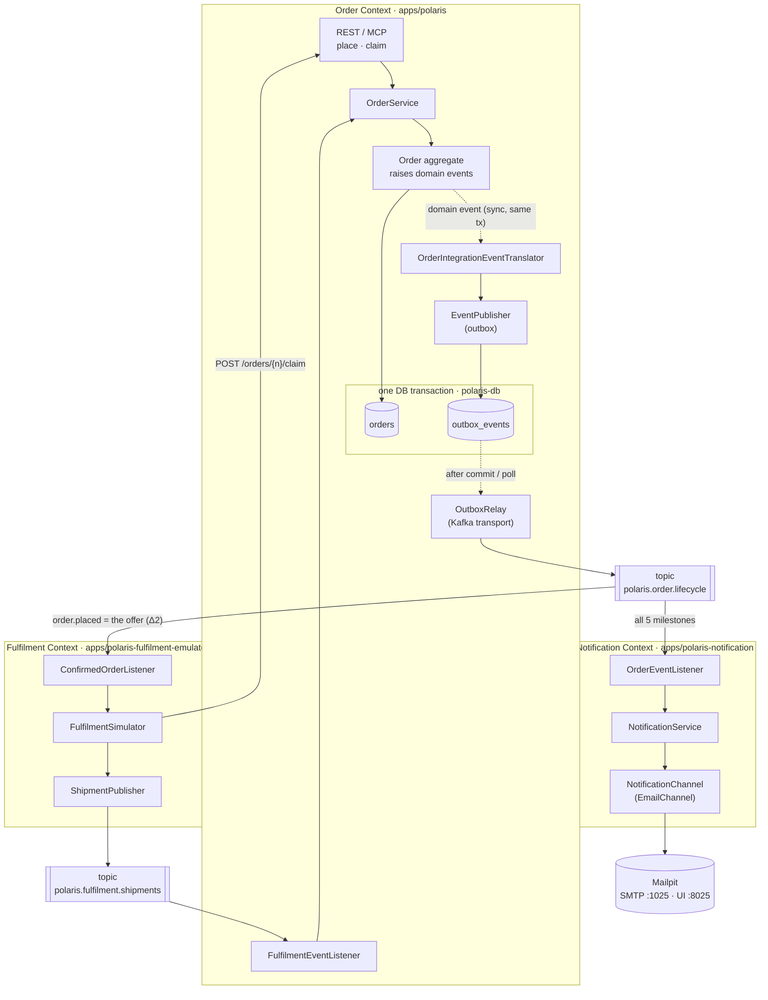
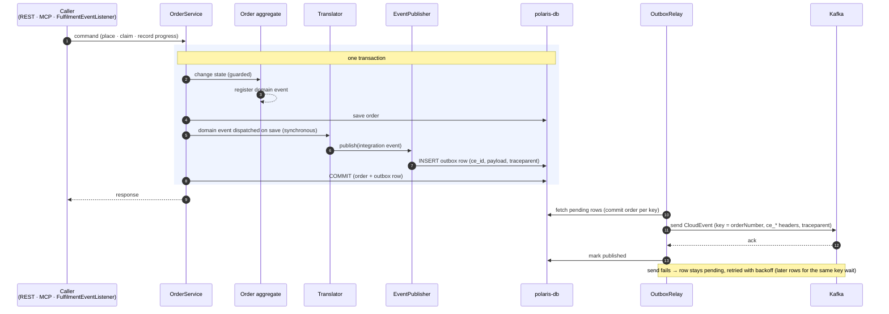
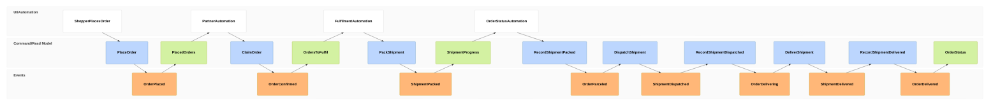
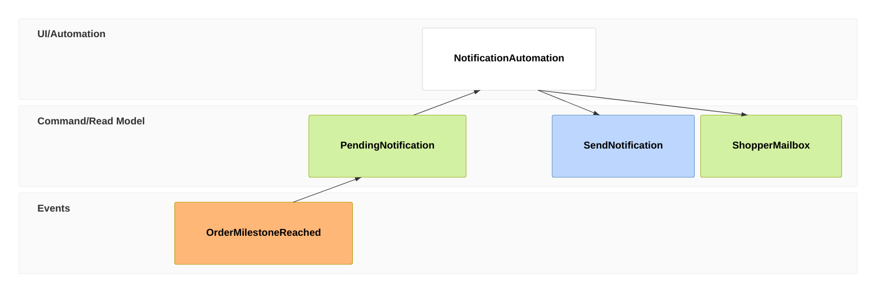

# EM-002: Order Lifecycle Notifications & Fulfilment (Kafka)

- **Use case:** "Follow my order" — [PRD-007](../../business/prds/PRD-007-order-notifications-and-fulfilment-emulator.md) §2, from order placement to delivery, with one shopper email per milestone.
- **Sources:** [PRD-007](../../business/prds/PRD-007-order-notifications-and-fulfilment-emulator.md); order statuses from [PRD-002](../../business/prds/PRD-002-comprehensive-order-apis.md) and [`OrderStatus.java`](../../../apps/polaris/src/main/java/vn/danang/polaris/order/entity/OrderStatus.java).
- **Status:** **Partly built.** The Order Context (partner claim, shipment progress, transactional outbox) and the Fulfilment emulator (`apps/polaris-fulfilment-emulator`) are implemented and covered by `make e2e-fulfilment`; the Notification Context (`apps/polaris-notification`, Mailpit) is not yet built. Unlike [EM-001](EM-001-order-staging-out-of-stock-exception.md) this model has no as-built section, so for those two contexts read the boxes as design intent that the code follows. The [As-Is Baseline](#1-as-is-baseline) lists what already exists.
- **Scope:** Happy path only. It is a demo of Kafka + Spring Boot inside Polaris, not a production fulfilment design.
- **Partner claim (updated 2026-09-30):** a fulfilment **partner claims** an order over REST, first wins; staff no longer confirm. See §3.1 and the programme departures [Δ1–Δ3, Δ6, Δ7](../../development/plan/order-notifications-and-fulfilment/README.md#3-departures-from-em-002).
- **Publishing:** Order publishes through a **transactional outbox** (updated 2026-09-29; see §2.1 and the [programme plan](../../development/plan/order-notifications-and-fulfilment/README.md), Δ8).

See the [notation](README.md#notation) for frame types. Two conventions are specific to this model:
- An `evt` frame here **is published**: it's a CloudEvent on a Kafka topic. For Order, it's recorded in the outbox **in the same transaction** as the state change and relayed to Kafka after commit (§2.1). For the stateless Fulfilment emulator, it's sent directly (§6).
- An automated application acting on events (Fulfilment, the Order status updater, Notification) appears as a `ui` frame named `…Automation`. It plays the same role as a screen: it reads the preceding view and issues the next command.

---

## 1. As-Is Baseline

| Needed | Exists today? |
| :--- | :--- |
| Statuses `PLACED`, `CONFIRMED`, `PARCELED`, `DELIVERING`, `DELIVERED` | Yes: [`OrderStatus.java:5`](../../../apps/polaris/src/main/java/vn/danang/polaris/order/entity/OrderStatus.java), DB `CHECK` in [`V1__init_schema.sql:22-23`](../../../libs/polaris-common/src/main/resources/db/migration/V1__init_schema.sql). No migration needed for statuses (the outbox table is new, §5.1). |
| `PlaceOrder` command | Yes: `OrderService.placeOrder` ([`OrderService.java:50-121`](../../../apps/polaris/src/main/java/vn/danang/polaris/order/service/OrderService.java)), REST `POST /api/v1/orders` and MCP `place_order` |
| `ConfirmOrder` command | **Replaced by `ClaimOrder`** (Δ1): a partner claims a `PLACED` order and it becomes `CONFIRMED`; there is no staff confirm |
| Transitions to `PARCELED` / `DELIVERING` / `DELIVERED` | **No** |
| Customer email for the recipient | Yes: `Customer.email` ([`Customer.java:29`](../../../apps/polaris/src/main/java/vn/danang/polaris/order/entity/Customer.java)) |
| Kafka, outbox, event publishing, Mailpit | **No.** No broker in [`docker-compose.yml`](../../../docker-compose.yml), no `outbox_events` table and no `spring-kafka` dependency |

---

## 2. Context Map

Three bounded contexts talk only through two Kafka topics. Each topic is owned by the context that publishes to it.



**Key decision: Order relays fulfilment progress; Notification never listens to Fulfilment.**
Fulfilment reports *shipment* facts (`packed`, `dispatched`, `delivered`) on its own topic. The Order Context, the single owner of order status, turns them into *order* milestones and republishes them on `polaris.order.lifecycle`. As a result:
- Notification depends on exactly one published contract (Order's), whatever produces the milestones.
- An email is sent only after the order status has actually been saved, so the shopper never hears "delivered" for an order the system still shows as `DELIVERING`.
- Fulfilment never writes to Order's tables or calls Order's internals ([AGENTS.md](../../../AGENTS.md) Principle 2.2).

### 2.1 Publishing path: domain events → transactional outbox → Kafka

Order code never talks to Kafka. A state change raises a **domain event** inside the aggregate; a synchronous translator turns it into the published **integration event** (§4) and hands it to the generic `EventPublisher`, which writes an outbox row in the same transaction. The `OutboxRelay` delivers committed rows to Kafka.



- **Rollback** (e.g. insufficient stock) removes the outbox row with the state change: no phantom event.
- **Kafka down** doesn't fail the request: rows stay pending and are delivered, in order per key, once Kafka is back.
- **At-least-once:** a crash between Kafka's ack and "mark published" re-sends the row with the same `ce_id`.
- The relay wakes up right after commit and also polls as a safety net, so normal latency stays well under a second.
- The mechanism is generic: another context with a database adds events by writing a translator, with no new publisher or table.

---

## 3. Event Model

### 3.1 Order journey (Order ↔ Fulfilment)



1. **01–03 — Place (exists):** The shopper (via the Assistant's `place_order` tool or REST) issues `PlaceOrder`. The order is saved `PLACED` and stock deducted, as today. **New:** `OrderPlaced` is recorded in the outbox in the same transaction and relayed to Kafka after commit (§2.1). An idempotent replay of the same `Idempotency-Key` returns the existing order and raises nothing.
2. **04–07 — Claim (replaces staff confirm, Δ1–Δ3):** Each partner in the emulator consumes `order.placed.v1` from `polaris.order.lifecycle` in its own consumer group; that event is the *offer* (Δ2). After a random pause each partner calls `POST /api/v1/orders/{orderNumber}/claim` with its `partnerId`, authenticated as the emulator's service client (`client_credentials`, permission `order.fulfil`). Order serialises claims on the order row: the first claim on a `PLACED` order wins and gets `200`; every later claim, a repeat by the winner, or a claim on a `CANCELLED` order gets `409` (`order-not-claimable` Problem Detail, Δ6) and no event. The `409` body does not name the winner. On success the order is `CONFIRMED` with `assignedPartner` and claim time recorded (Δ3), and `OrderConfirmed` is recorded in the outbox in the same transaction. Cancellation locks the same row, so a cancel and a claim on one order cannot both succeed (Δ7); cancelling an already claimed (`CONFIRMED`) order keeps its previous behaviour and will be owned by a separate process.
3. **08–11 — Pack (Fulfilment):** `OrdersToFulfil` is the claim result: only the partner that received `200` continues (the loser does nothing further). `FulfilmentAutomation` waits `step-delay`, then `PackShipment` → publishes `ShipmentPacked` (carrying its `partnerId`) on `polaris.fulfilment.shipments`.
4. **12–15 — Order follows (Order Context):** `OrderStatusAutomation` (`FulfilmentEventListener` in `apps/polaris`) reads `ShipmentPacked` and issues `RecordShipmentPacked` → `OrderService.recordShipmentProgress(orderNumber, PACKED)`, which moves `CONFIRMED → PARCELED` and records `OrderParceled` in the outbox in the same transaction.
5. **16–23 — Dispatch and deliver:** Same pattern twice more. Fulfilment schedules each next step on its own timer (it does not wait for Order), and Order maps `ShipmentDispatched → DELIVERING` and `ShipmentDelivered → DELIVERED`, publishing `OrderDelivering` and `OrderDelivered`.
6. **24 — View:** `OrderStatus` is the existing `GET /api/v1/orders/{orderNumber}/status` and MCP `get_order_details`, now showing `DELIVERED`.

**Rejected / no-op commands (bare `rmo`, no event):** each `Record…` command is guarded by the assigned partner and the expected *previous* status; a report from a partner other than the assigned one is also ignored, (`PACKED` needs `CONFIRMED`, `DISPATCHED` needs `PARCELED`, `DELIVERED` needs `DELIVERING`). A duplicate or late report finds the order in some other status, logs at `INFO`, and records nothing in the outbox, so no duplicate email is sent ([PRD-007](../../business/prds/PRD-007-order-notifications-and-fulfilment-emulator.md) Scenario 5). A `CANCELLED` order also stops here, even if the emulator keeps running.

### 3.2 Notification slice (repeats for each of the 5 order milestones)



1. **01:** Any of `OrderPlaced`, `OrderConfirmed`, `OrderParceled`, `OrderDelivering`, `OrderDelivered` arrives on `polaris.order.lifecycle`.
2. **02:** `PendingNotification` is built only from the event data: recipient (`customer.email`, `customer.name`), order number, milestone, and items and total. Notification never calls back into the Order Context (event-carried state transfer).
3. **03–04:** `NotificationService` picks the template for the milestone and sends `SendNotification` to every enabled `NotificationChannel`. Only `EmailChannel` exists now, and it is the default. It uses Spring `JavaMailSender` over SMTP to Mailpit.
4. **05 — bare `rmo`:** The Notification Context persists nothing (no table, no event). The only outcome is the message in the shopper's mailbox, which is Mailpit's inbox in local development. Adding a notification log with `NotificationSent` events is deferred (§7).

---

## 4. Event Contracts (CloudEvents on Kafka)

Every message uses **CloudEvents 1.0, Kafka protocol binding, binary content mode**:
- CloudEvents attributes go in Kafka headers: `ce_specversion=1.0`, `ce_id` (UUID), `ce_source`, `ce_type`, `ce_subject` (= order number), `ce_time`, `content-type=application/json`.
- The record **key** is the order number, so all events of one order land on the same partition and are consumed in order.
- The record **value** is the JSON `data` shown below.
- W3C `traceparent` / `tracestate` headers: for Order events, the trace context is captured when the outbox row is written and restored by the relay before sending, so the record joins the originating request's trace (§5.4). Fulfilment's headers come from Spring Kafka observation.

### 4.1 Topics

| Topic | Owner (sole producer) | Consumers (group id) | Partitions (dev) | Key |
| :--- | :--- | :--- | :--- | :--- |
| `polaris.order.lifecycle` | Order Context (`ce_source=/polaris/order`) | `polaris-fulfilment-emulator`, `polaris-notification` | 3 | `orderNumber` |
| `polaris.fulfilment.shipments` | Fulfilment Context (`ce_source=/polaris/fulfilment`) | `polaris-order` | 3 | `orderNumber` |

Each owner declares its topic as a `NewTopic` bean, so the topic is created on startup. The broker's auto-create is turned off to keep dev behaviour close to production.

### 4.2 Event catalogue

| `ce_type` | Topic | Emitted when | Consumed by |
| :--- | :--- | :--- | :--- |
| `vn.danang.polaris.order.placed.v1` | order.lifecycle | `PLACED` committed (with its outbox row) | Notification, Fulfilment (the offer) |
| `vn.danang.polaris.order.confirmed.v1` | order.lifecycle | `PLACED → CONFIRMED` (a partner claimed it; carries `assignedPartner`) | Notification |
| `vn.danang.polaris.order.parceled.v1` | order.lifecycle | `CONFIRMED → PARCELED` | Notification |
| `vn.danang.polaris.order.delivering.v1` | order.lifecycle | `PARCELED → DELIVERING` | Notification |
| `vn.danang.polaris.order.delivered.v1` | order.lifecycle | `DELIVERING → DELIVERED` | Notification |
| `vn.danang.polaris.fulfilment.shipment.packed.v1` | fulfilment.shipments | emulator packed | Order |
| `vn.danang.polaris.fulfilment.shipment.dispatched.v1` | fulfilment.shipments | emulator dispatched | Order |
| `vn.danang.polaris.fulfilment.shipment.delivered.v1` | fulfilment.shipments | emulator delivered | Order |

All five order events share **one payload shape** (`OrderLifecycleEvent`), so consumers use a single DTO and switch on `ce_type`/`status`. All three shipment events share `ShipmentEvent`.

`OrderLifecycleEvent` (value of `vn.danang.polaris.order.*.v1`):
```json
{
  "orderNumber": "ORD-10042",
  "status": "CONFIRMED",
  "occurredAt": "2026-09-28T09:15:02.311Z",
  "customer": { "id": 1, "name": "Alice Tran", "email": "alice.tran@example.com" },
  "items": [
    { "sku": "NG-EARBUD-01", "name": "Nova Wireless Earbuds", "quantity": 1, "unitPrice": "49.90" },
    { "sku": "NG-CHARGER-01", "name": "Fast Charger", "quantity": 2, "unitPrice": "24.90" }
  ],
  "totalAmount": "99.70",
  "currency": "USD"
}
```
Money is a JSON **string**, so no float rounding is possible and consumers need no special `BigDecimal` deserializer settings.

`ShipmentEvent` (value of `vn.danang.polaris.fulfilment.shipment.*.v1`):
```json
{ "orderNumber": "ORD-10042", "shipmentId": "SHP-7f3c…", "step": "PACKED", "occurredAt": "2026-09-28T09:15:07.402Z" }
```

**Versioning:** The `.v1` suffix is in `ce_type`, not the topic name. Changes are additive only (new optional fields). A breaking change would introduce `.v2` types on the same topic, published alongside `.v1` during a deprecation window.

**Where the contract lives:** The payload records go in `libs/polaris-common` under `vn.danang.polaris.events.order` / `.fulfilment`, together with a `CloudEventHeaders` constants class. This shared package is the *published contract* only: no behaviour, and no JPA entities.

---

## 5. Application Design

### 5.1 Order Context: `apps/polaris` (changed)

| Component | Responsibility |
| :--- | :--- |
| `OrderController` | **+** `POST /api/v1/orders/{orderNumber}/claim` `{partnerId}`, `@PreAuthorize("hasAuthority('PERM_order.fulfil')")` → `200 OrderResponse`, `404`, `409 order-not-claimable` Problem Detail (Δ1, Δ6). `assignedPartner` is shown by `GET /api/v1/orders/{n}` and MCP `get_order_details` |
| `OrderService` | **+** `claimOrder(orderNumber, partnerId)` (row-locked; `cancelOrder` takes the same lock, Δ7), **+** `recordShipmentProgress(orderNumber, ShipmentStep)`. Each state change goes through an `Order` method that registers an `OrderStatusChanged` **domain event**; saving the order dispatches it inside the transaction. The existing `placeOrder` does the same for new orders only, not idempotent replays. |
| `order/messaging/OrderIntegrationEventTranslator` | Synchronous listener, same transaction: maps `OrderStatusChanged` → `OrderLifecycleEvent`, picks `ce_type`, and calls `EventPublisher.publish(…)`. No `KafkaTemplate` in the Order Context. |
| Outbox library (`EventPublisher`, `OutboxRelay`, Kafka transport) | Generic, not Order-specific. `EventPublisher` writes an `outbox_events` row in the caller's transaction (fails fast without one). `OutboxRelay` sends committed rows to Kafka in order per key, retries with backoff, marks them published, and purges old ones (§2.1). |
| `order/messaging/FulfilmentEventListener` | `@KafkaListener(topics = "polaris.fulfilment.shipments", groupId = "polaris-order")` → `OrderService.recordShipmentProgress` |
| `order/messaging/KafkaTopicsConfig` | `NewTopic polaris.order.lifecycle` |
| Migration | `outbox_events` table in `polaris-db`, and V16: `assigned_partner` and claim time on `orders` with a `CHECK` requiring a partner for fulfilled statuses (Δ3) |

Status guard (the only new domain rule), added to `OrderStatus`:
```java
public OrderStatus next(ShipmentStep step)   // CONFIRMED+PACKED→PARCELED, PARCELED+DISPATCHED→DELIVERING, DELIVERING+DELIVERED→DELIVERED, else empty/no-op
```

### 5.2 Fulfilment Context: `apps/polaris-fulfilment-emulator` (new, stateless emulator)

| Package | Component | Responsibility |
| :--- | :--- | :--- |
| `messaging` | `OfferListenerRegistrar` (one consumer group per partner) | Consumes `polaris.order.lifecycle` and ignores every `ce_type` except `order.placed.v1`; each partner pauses randomly, then claims over REST. Only the winner (`200`) starts a shipment |
| `domain` | `FulfilmentSimulator` | Uses `TaskScheduler` to schedule `PACKED` at +d, `DISPATCHED` at +2d and `DELIVERED` at +3d (`d = polaris.fulfilment.step-delay`, default `PT5S`) |
| `messaging` | `ShipmentPublisher` | Sends `ShipmentEvent` to `polaris.fulfilment.shipments` |
| `config` | `FulfilmentProperties`, `KafkaTopicsConfig` | Step delay; `NewTopic polaris.fulfilment.shipments` |

No database and no REST API (only `/actuator`). If the emulator restarts, in-flight simulations are lost. That is acceptable for a demo; to recover an order, place a new one.

### 5.3 Notification Context: `apps/polaris-notification` (new, stateless)

| Package | Component | Responsibility |
| :--- | :--- | :--- |
| `messaging` | `OrderEventListener` | Consumes all 5 `order.*.v1` types from `polaris.order.lifecycle` |
| `domain` | `NotificationService` | Builds a `Notification(recipient, subject, body, milestone)` from the event and sends it to every enabled channel |
| `domain` | `NotificationChannel` (interface) | `ChannelType type(); void send(Notification n)`. Adding SMS or push later means adding one more bean. |
| `channel.email` | `EmailChannel` | `JavaMailSender`, plain-text templates per milestone (`templates/order-<status>.txt`) |
| `config` | `NotificationProperties` | `polaris.notification.channels=email` (default), `polaris.notification.from=no-reply@polaris.local` |

Dependency direction: `messaging → domain ← channel.email` (the domain owns the `NotificationChannel` port, and channels implement it).

### 5.4 Cross-cutting (applies to all three apps)

| Concern | How |
| :--- | :--- |
| **Tracing** | `spring.kafka.template.observation-enabled=true` and `spring.kafka.listener.observation-enabled=true` add W3C `traceparent` to each record header and continue the trace on consume. For Order events the relay first restores the trace context stored in the outbox row, so a record sent later still belongs to the request that caused it. Fulfilment's delayed steps run on a `TaskScheduler` wrapped with `ContextPropagatingTaskDecorator`, so the trace survives the delay. Result: one trace from `POST /orders` through three shipment steps to the emails. |
| **Logs** | Existing OTLP logback appender; every log line carries `trace_id`, `span_id`, `orderNumber`, `ce_type`. |
| **Metrics** | Built-in `spring.kafka.template` / `spring.kafka.listener` timers; **+** outbox backlog, oldest-pending age and publish lag; **+** `polaris.notifications.sent{channel,milestone,outcome}` counter. Exported over OTLP as today. |
| **Serialization** | Order: the payload is serialized to JSON once, when the outbox row is written, and the relay sends the bytes unchanged. Fulfilment: `JsonSerializer` with `spring.json.add.type.headers=false`. Either way there are no Java class names on the wire. Consumer: `StringDeserializer`, then Jackson maps the value to the DTO chosen by `ce_type`. |
| **Errors** | Default `DefaultErrorHandler` (a few in-memory retries with back-off, then log and skip). No DLT for the demo. |
| **Config (12-factor)** | `SPRING_KAFKA_BOOTSTRAP_SERVERS=kafka-1:9092,kafka-2:9092,kafka-3:9092`, `SPRING_MAIL_HOST=mailpit`, `SPRING_MAIL_PORT=1025`, `POLARIS_FULFILMENT_STEP_DELAY=PT5S`, plus the existing `MANAGEMENT_OTLP_*` / `MANAGEMENT_OPENTELEMETRY_*` endpoints |

### 5.5 Local infrastructure (`docker-compose.yml` additions)

| Service | Image | Notes |
| :--- | :--- | :--- |
| `kafka-1..3` | `apache/kafka:3.9.1` | Three-node KRaft cluster (no ZooKeeper; every node broker + controller), PLAINTEXT listeners `kafka-N:9092` on `polaris-net`, `KAFKA_AUTO_CREATE_TOPICS_ENABLE=false`, replication 3 with min ISR 2 (Plan 2 B3) |
| `mailpit` | `axllent/mailpit` (pin the version when implementing) | SMTP `1025` (internal), web UI `8025` published to the host → `http://localhost:8025` |
| `polaris-fulfilment-emulator` | built from `apps/polaris-fulfilment-emulator/Dockerfile` | depends on `kafka` |
| `polaris-notification` | built from `apps/polaris-notification/Dockerfile` | depends on `kafka`, `mailpit` |

`pom.xml` gets two new `<module>` entries. `spring-kafka` and `spring-boot-starter-mail` versions come from the Spring Boot parent.

---

## 6. Delivery Guarantees

| Situation | Behaviour | Accepted because |
| :--- | :--- | :--- |
| DB commit succeeds, then Kafka is down or the app crashes | **No loss.** The event is in the outbox; the relay delivers it once Kafka or the app is back, in order per order number | Transactional outbox (§2.1) |
| Relay crashes after Kafka's ack, before marking the row published | Row re-sent with the same `ce_id` (at-least-once). Order: status guard makes it a no-op. Notification: duplicate email | Accepted. `ce_id` is stable, so consumer dedupe can be added later |
| State change rolls back | Outbox row rolls back with it: no event | Transactional outbox (§2.1) |
| Emulator's shipment send fails | Fulfilment has no database, so it sends directly without an outbox; the report is lost and the order stays at its last milestone | Emulator only |
| Consumer processes a record, then crashes before committing the offset | Record redelivered (at-least-once). Order: the status guard makes it a no-op. Notification: **duplicate email** | Demo scope. Upgrade path: a `processed_events(ce_id)` table in Notification |
| Emulator restarts mid-simulation | That order stays at its last milestone | Emulator only |
| Order cancelled while fulfilment is simulated | Emulator keeps publishing. Order's status guard ignores the reports (`CANCELLED` is not a valid previous state). No email | Cancellation notifications are out of scope ([PRD-007](../../business/prds/PRD-007-order-notifications-and-fulfilment-emulator.md) §6) |

Ordering: per-order ordering holds because the relay sends rows in commit order per `orderNumber` (a failing row holds back later rows for the same order), every event is keyed by `orderNumber`, and each consumer group reads a partition sequentially.

---

## 7. Implementation Slices

Split per bounded context ([AGENTS.md](../../../AGENTS.md) Principle 2). Each slice works end-to-end on its own and can be verified against real Kafka.

| # | Slice | Context | Done when | Tests |
| :--- | :--- | :--- | :--- | :--- |
| S0 | Kafka + Mailpit in compose; `events` contract package in `polaris-common` | Platform | `docker compose up` starts both, and Mailpit UI is reachable | JSON round-trip test for each payload record |
| S1 | `ClaimOrder` endpoint (replaces the staff confirm slice) + outbox publishing (translator, `EventPublisher`, `OutboxRelay`) | Order | Placing and claiming an order produces `placed`/`confirmed` records on `polaris.order.lifecycle` | `@SpringBootTest` + **Testcontainers Kafka + Postgres**: outbox row committed with the order, nothing on rollback, nothing on idempotent replay, delivered after a Kafka outage; `409` on invalid confirm |
| S2 | `FulfilmentEventListener` + `recordShipmentProgress` | Order | Hand-produced shipment events move the order to `DELIVERED` and republish milestones | Testcontainers Kafka; guard matrix (valid, duplicate, out-of-order, cancelled) |
| S3 | `apps/polaris-fulfilment-emulator` | Fulfilment | An offer (`order.placed.v1`) yields one claim per partner and, for the winner, 3 shipment events in order | Testcontainers Kafka, with `step-delay=PT0.1S` |
| S4 | `apps/polaris-notification` | Notification | Each order event yields one email in Mailpit | Testcontainers Kafka + **Mailpit container**, asserting through Mailpit's REST API (`GET /api/v1/messages`) |
| S5 | End-to-end demo | All | [PRD-007](../../business/prds/PRD-007-order-notifications-and-fulfilment-emulator.md) Scenarios 1–3 and 6: 5 emails in Mailpit and one connected trace in Grafana. Scenarios 2, 4–7 (claim, shipment, 5 events on Kafka, more than one winning partner): `make e2e-fulfilment` (`tests/e2e/run-fulfilment.sh`) | k6 scenario `tests/e2e/k6/fulfilment.js`: place → (partners claim) → poll to `DELIVERED`; then `tests/e2e/verify-kafka-events.sh` checks the 5 `order.*.v1` events per order on Kafka, in order. The Mailpit check belongs to the notification scenarios, not this command |

S3 and S4 depend only on S0's contract and can be built in parallel with S1–S2.
